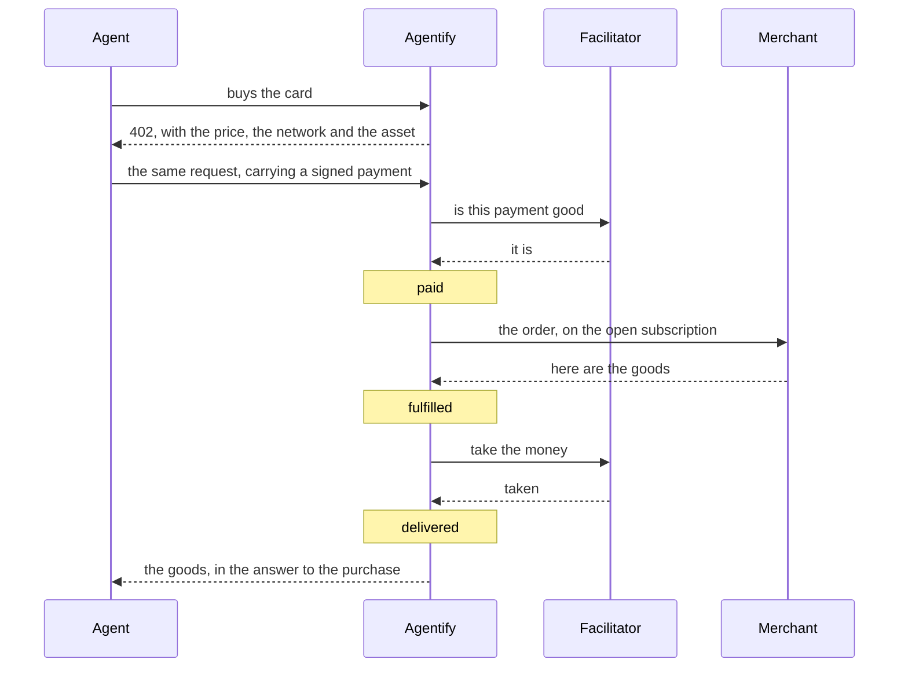
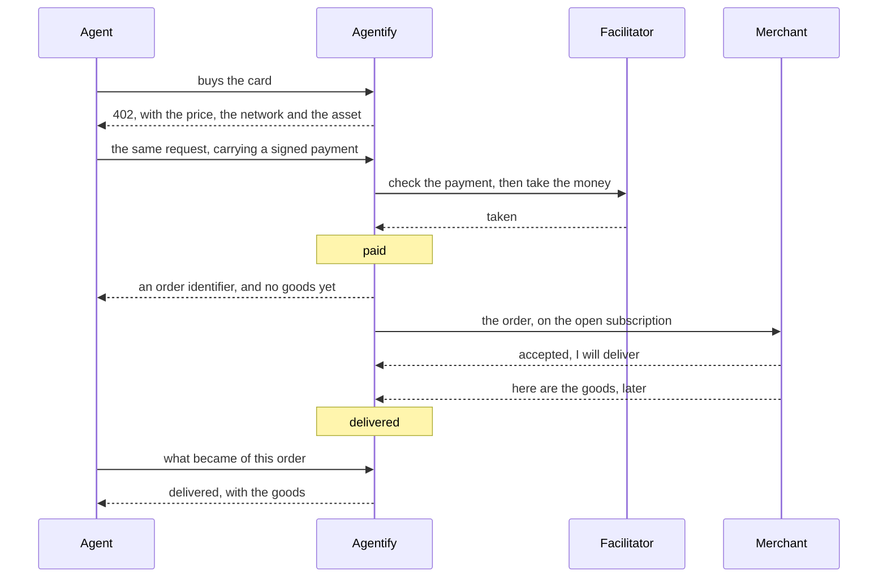
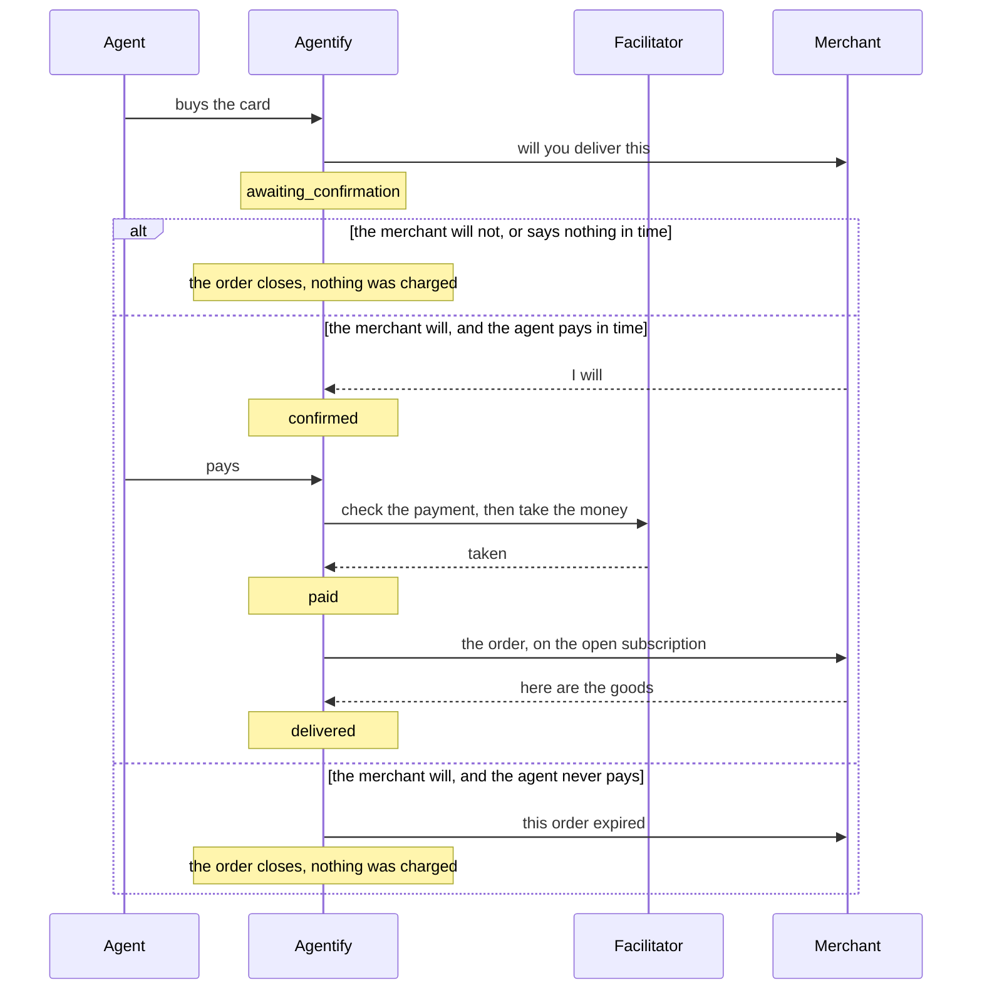

# Agentify

[](https://github.com/nuanu-ai/agentify/actions/workflows/ci.yml)
[](https://www.npmjs.com/package/@nuanu-ai/agentify)
[](https://www.npmjs.com/package/@nuanu-ai/agentify-contracts)
[](LICENSE)

The gateway through which an ordinary online business sells its goods to AI
agents, paid in stablecoins over the x402 protocol. The money goes from the
buyer's wallet to the merchant's and never passes through us.

A merchant integrates through one npm package, `@nuanu-ai/agentify`. It
publishes product cards, receives paid orders over a single outgoing connection
and closes each order with the goods or with a refusal. The package and the
gateway agree on a contract version — `"2"` today — and an unreadable wire
change moves that version before the gateway sends it (ADR-0006). There is no
external merchant yet: the first merchant we do not control is the boundary
from which compatibility becomes a written decision rather than a habit.

This file orients an engineer who has just opened the repository. What a
merchant reads is at [agentify.ad/docs](https://agentify.ad/docs/), and it is
built from `apps/docs` in this repository.

## Contents

- [Prerequisites](#prerequisites)
- [Run it](#run-it)
- [Approving a production merchant](#approving-a-production-merchant)
- [What happens in a sale](#what-happens-in-a-sale)
- [The stand](#the-stand)
- [Repository layout](#repository-layout)
- [Checks](#checks)
- [Releasing the SDK](#releasing-the-sdk)
- [Deploying](#deploying)
- [Where to read more](#where-to-read-more)
- [License](#license)

## Prerequisites

Node.js 24.21 — the exact version is in `.nvmrc`, and `pnpm install` refuses
another one because `.npmrc` sets `engine-strict`. pnpm 11.12 arrives through
Corepack from the `packageManager` field of the root `package.json`, the same
way CI gets it:

```sh
corepack enable
pnpm install
```

Installing also points git at `.githooks`, where a `commit-msg` hook holds the
Conventional Commits format. Docker with Compose v2 runs the stack below, and
`pnpm test` needs a `python3` on the path for the scanner's operational tests.

## Run it

```sh
docker compose up --build
open http://localhost:8080
```

One origin, one port: the landing at `/`, the merchant documentation at
`/docs`, the cabinet at `/cabinet`, the merchant's own calls at `/v0`, the
storefront an agent buys from under `/x402`, Postgres behind them. A merchant
process comes up beside it and publishes two cards — a rented phone number
sold synchronously, an eSIM sold asynchronously.

Nothing buys by itself. The buyer is the one thing that runs on the host rather
than in the stack, so the workspace needs its dependencies first:

```sh
pnpm buy                      # the first card in the catalogue
pnpm buy esim                 # the one delivered later
```

The gateway settles against nothing locally (ADR-0008): a purchase completes
with no wallet, no network and no faucet, and the first line of its log says so.

The cabinet is where a merchant sets the name buyers see and issues the keys
their own code calls with. Open its email sign-in form:

```sh
open http://localhost:8080/cabinet/sign-in
```

Enter your email address, open the one-time link and press its confirmation
button. The local sandbox writes the message to the cabinet log; a deployed
cabinet sends it by email. Confirming the link signs you in and creates your
merchant if you do not already have one, then asks for the name buyers see.
There is no password and no invitation code (ADR-0026). The credential the
cabinet uses for that merchant stays in the cabinet.

That merchant is a new one, and it is not `the_merchant` — the merchant the
stack seeds, whose two cards the merchant process publishes and `pnpm buy`
buys. Somebody who has just registered has no cards and no keys of their own,
which is the truth about a merchant who has written no code yet (ADR-0014).

If port 8080 is taken, `AGENTIFY_HOST_PORT=8090 docker compose up` moves the
stack and nothing else — the buy command runs on the host and needs
`GATEWAY_URL=http://localhost:8090 pnpm buy`.

## Approving a production merchant

From the operator's local checkout, run `pnpm approve <email>`. The command uses
SSH access to the production host, resolves that cabinet account's existing
merchant and records its one-time approval for live sales. It prints the
production target, resolved account, seller and merchant ID. Repeating it is
safe and reports that approval already exists; an unknown or unbound account
is refused without creating anything.

Approval does not publish cards or supply a missing seller name or payout
wallet. The test channel needs no operator approval. This is a private
application command; ordinary infrastructure deployment still uses Ansible.

## What happens in a sale

A card is one product written so that a program can decide to buy it: a title,
a description, a price, and the list of what has to be given at purchase. A
merchant publishes cards through the SDK, and every card is an address an agent
can pay against.

The purchase is an HTTP request to that address. The gateway answers `402
Payment Required` with a challenge naming the price, the network and the asset;
the agent signs a payment and repeats the request carrying it. That exchange is
x402, and the protocol itself comes from the official packages — what this
repository adds is knowing which order a payment is for.

The merchant's side is one process standing beside their existing API: a
handler. It listens on no port — it opens a single outgoing subscription and
receives paid orders, price questions and order events on that one stream
(ADR-0004). Everything it is written against is `@nuanu-ai/agentify`.

The order is a state machine of sixteen states in `packages/core`, a pure
function with no IO. The gateway feeds it events and gets back the next state
together with the effects that state implies, and those effects are written
down in the same transaction as the state itself (ADR-0013). What the card
declares before payment is which of the three sequences below the sale follows.

### Synchronous fulfillment

The goods come back in the answer to the purchase, and the money moves only
once the merchant has produced them. A refusal costs the buyer nothing.



The goods are held until the money settles, so a delivery whose charge failed
hands nothing over.

### Asynchronous fulfillment

The money moves at the purchase, before the merchant is asked for anything. The
agent leaves with an order identifier and collects the goods later — minutes
later or a day later, which makes no difference to the shape.



Knowing the identifier is the whole of the agent's proof, so the status call
takes no key (ADR-0011).

### Fulfillment against a confirmation

The merchant says whether they will deliver before the buyer is charged at all,
so this is the mode whose branches matter more than its happy path.



How the agent is told it may now pay is the piece that does not exist. The
machine emits an `invite_payment` effect at the confirmation and the gateway
throws on it rather than invent a message no contract describes, which is what
closing the mode at the door means: a card asking for `confirm` is refused at
publication, and ADR-0007 lists what wiring it up would touch. The branches
above are the machine's — driving it through the three endings is where they
come from — and the payment arrow deliberately does not say how the agent
learned it was invited.

## The stand

A purchase has three participants, and the stand is a local console that lets
one person sit in each of them in turn. It is our own instrument rather than a
product surface — no merchant is handed it, it is not a second interface to the
gateway, and it listens on loopback only — but its merchant half is written to
be read by somebody integrating against the SDK. Everything a merchant's code
can do there goes through `@nuanu-ai/agentify`: the subscription, publishing,
the orders and the calls that close them. Where a call is not on the SDK the
console says so at the button, because those are the merchant's cabinet
operations and the package does not carry them by decision.
`packages/slice/src/stand-merchant.ts` is the file to read.

```sh
pnpm stand
open http://127.0.0.1:8787
```

It needs a wallet of its own, because the buyer on it signs real payments. Put
a throwaway test key in `.env.stand` at the root of the repository as
`STAND_BUYER_KEY=0x…`, sixty-four hexadecimal characters, and never one holding
anything you would miss; `.env.*` is not committed, and the stand refuses to
start without a key rather than falling back to one everybody knows.
`STAND_PORT` moves it off 8787.

The console asks for a gateway address and a merchant key, and keeps the key in
its own process — the page and the log are handed the environment that key
names and never the key. Against the stack above the address is
`http://localhost:8080`.

Three tabs, one per seat. **Catalogue** publishes cards through the real SDK and
takes them off sale, and every row carries the address an agent buys that card
at. **Agent** is a stranger's buyer: the public catalogue as an agent reads it,
the two probes — the GET that quotes a card and opens nothing, the unpaid POST
that opens an order — and then the challenge, which sits on screen with its
requirements until you sign it, send something unreadable, or walk away.
**Orders** is the merchant's own code with you in its chair: a standing answer
for whatever arrives next, or hold every order and decide each one by hand.

The log runs down the side of all three and is threaded by the order, so a
purchase told from three seats reads as one conversation. It carries both
halves of every exchange the console makes, and says what it leaves out: the
SDK's own polling and the gateway's internal steps are not in it.
`docs/research/24-stand-boundary.md` is what the stand does and does not prove
— it is not the gateway's journal, and the payment layer is outside it.

## Repository layout

One pnpm workspace holds the commerce product and the scanner. They share the
toolchain and the lockfile; their check, test and build commands are scoped
separately in the root `package.json` because the two keep different compiler,
lint and test policies.

| Path | What it is |
| --- | --- |
| `apps/gateway` | The payment edge, the order runner and the queue. Ports in `src/ports`, their implementations in `src/adapters`. |
| `apps/cabinet` | The merchant's screens: cards, orders, receipts, keys, sign-in. Server-rendered, no client build (ADR-0005). |
| `apps/landing` | The public page — static HTML and CSS served by Caddy. |
| `apps/docs` | The merchant documentation, a VitePress site served at `/docs`. Its JSON examples are test fixtures (see below). |
| `apps/web` | The scanner: Agentify's public site and report application. |
| `apps/scanner-worker`, `apps/browser-observer-actor` | The scanner's background and passive browser-observation processes. |
| `packages/contracts` | `@nuanu-ai/agentify-contracts`: every shape that crosses a boundary, as zod schemas, and the route table both sides import instead of transcribing. |
| `packages/core` | The order state machine: pure logic, zero IO, zero runtime dependencies. |
| `packages/sdk` | `@nuanu-ai/agentify`: what a merchant integrates against. Its runtime tree is the contracts package and zod, and nothing else. |
| `packages/slice` | A mock merchant and a buyer, driving the offline gate, the `buy` and `smoke` commands, and the stand. |
| `packages/scanner-contracts`, `packages/scanner-database`, `packages/scanner` | The scanner's private contracts, storage and evaluation engine. |
| `packages/analytics`, `packages/observability`, `packages/remediation` | The scanner's remaining packages, kept separate from the engine. |
| `deploy/` | Dockerfiles, the Compose overlays for test and production, the Caddy route tables and the Ansible release playbooks. |
| `ops/`, `fixtures/` | The scanner's deployment definitions, operational checks and runtime test inputs. The production health monitor under `ops/deploy/workflows/` is retained configuration, not an active GitHub workflow. |
| `scripts/` | The commands the root `package.json` calls: the decision-log check, the outside install, the mutation run, worktree hygiene. |
| `docs/decisions/` | The numbered decisions — what is expensive to reverse, and why it was decided that way. |
| `docs/research/` | The working material behind them: research, runbooks, acceptance protocols. |

Gateway and cabinet share one Postgres and each owns its migrations under
`drizzle/`; `pnpm db:migrate` runs both.

The scanner uses a separate PostgreSQL 16.9 database on `127.0.0.1:55432` and
never reads the commerce `.env`. Start its local processes from the repository
root:

```sh
cp .env.scanner.example .env.scanner
pnpm scanner:db:up
pnpm scanner:db:migrate
pnpm scanner:dev
```

The web application listens on port 3000 and worker health on port 8081.
`pnpm scanner:db:down` stops the scanner database without deleting its named
volume. Scanner verification is exposed through `scanner:check`,
`scanner:test:integration`, `scanner:test:actor`, `scanner:test:db`,
`scanner:build` and `scanner:self-readiness`.

Scanner email confirmation calls the cabinet's private identity route. The
cabinet owns Better Auth and sends report links through Resend; scanner report
sessions remain separate from cabinet sessions. Confirmation creates or confirms
a person; a merchant is attached only when that person enters the cabinet. For
local confirmation, run the cabinet with `REPORT_IDENTITY_SECRET` and configure
the scanner with the same secret and `CABINET_IDENTITY_URL` pointing to its
private listener on port 3002. Scanning alone does not need that connection.
Local email evidence stays in the cabinet process. See
[ADR-0026](docs/decisions/0026-one-way-in.md) for the identity boundary and
[ADR-0024](docs/decisions/0024-scanner-identity-without-supabase.md) for retained
report ownership. The completed database and identity handoff remains in Git
history; current delivery and recovery rules are in the
[release operations guide](deploy/ansible/README.md).

The scanner code was imported from `nuanu-ai/agent-first-project` commit
`33f3385d2be825022133b55d889f8a690f736e69` under the repository's
Apache-2.0 terms. Private research, meetings, marketing and release evidence,
local configuration, secrets and source history are not part of the import.

## Checks

```sh
pnpm check          # formatting and lint
pnpm typecheck
pnpm test           # offline, free, no network
pnpm check:decisions
```

That is the gate before a push. CI runs the same four on every push and pull
request, and beyond them the database suite, the build of every package and of
the portal, and the scanner's integration tests; the workflow is
`.github/workflows/ci.yml`. A green run publishes nothing and deploys nothing.

The portal's JSON examples and its tables of how an order can end are read by
the contracts and core test suites out of the very files the pages render, so a
page and the behavior it describes cannot drift apart quietly.

A few more checks cost something — a database, the network, or money — and are
kept apart for that reason:

- `pnpm test:db` needs a Postgres (`docker compose up -d --wait postgres`) and
  fails rather than skipping when there is none.
- `pnpm outside` packs the tarballs npm would publish, installs them into a
  directory with no path back here, and runs the commands the quickstart gives
  a merchant.
- `pnpm smoke:listing <https address>` asks Coinbase whether our resource would
  be listed, and reports no verdict rather than a pass when it cannot reach us.
- `pnpm smoke` walks the same buyer and mock merchant against the real
  facilitator on the Base Sepolia testnet. It refuses to start without
  `AGENTIFY_SMOKE=1`, is a dry run unless `--confirm` is given, and caps every
  payment at `SMOKE_MAX_USD`; the header of `packages/slice/src/smoke.ts` lists
  everything it needs.
- `pnpm mutate <package>` runs Stryker over one workspace package and prints
  the survivors. It is a triage tool for the hand-over ritual, not a gate.

## Releasing the SDK

Two packages are public, `@nuanu-ai/agentify-contracts` and
`@nuanu-ai/agentify`, and they are released together from one commit. Every
change to either carries a Changeset (`pnpm changeset`). A release is prepared
on `main` with `pnpm changeset version`, and pushing a tag `sdk-v<version>` runs
`.github/workflows/publish-sdk.yml`: it waits for CI to pass on that exact
commit, refuses a tag whose version differs from the SDK manifest, publishes
through npm Trusted Publishing with no stored token, and then installs the
exact versions back from the registry and imports them. The full procedure,
including the one-time bootstrap of the package names, is in
[`docs/research/22-sdk-release.md`](docs/research/22-sdk-release.md).

## Deploying

Test and production run the same source revision and the same service graph
on separate hosts with isolated data (ADR-0016). Nothing deploys automatically
— not a tag, not a green CI run. An operator stages a full commit SHA on test
with the Ansible playbook, activates and accepts it there, and only then stages
and activates the same SHA on production. The procedure is the
[release operations guide](deploy/ansible/README.md); the Compose overlays it
applies live under `deploy/`.

## Where to read more

- [`apps/docs/`](apps/docs/) — what a merchant reads: the owner's decision, the
  engineer's integration, the operator's questions. Published at
  [agentify.ad/docs](https://agentify.ad/docs/).
- [`packages/sdk/README.md`](packages/sdk/README.md) — the npm page of the
  merchant SDK, and [`packages/contracts/README.md`](packages/contracts/README.md)
  the same for the contracts.
- [`docs/decisions/`](docs/decisions/) — what is expensive to reverse, and why
  it was decided that way.
- [`docs/vision.md`](docs/vision.md) — the product vision, for whoever is
  deciding whether to connect.
- [`AGENTS.md`](AGENTS.md) — the working discipline: how decisions are
  recorded, what a test has to answer for, why a check that did not run never
  reports success.

Engineering artifacts are written in English; research and product documents in
the language of their readers, which is why some of the above is in Russian.

## License

Agentify is licensed under the Apache License 2.0. Distributions must retain
the notices required by that license, including the attribution to Nuanu AI in
[`NOTICE`](NOTICE). See [`LICENSE`](LICENSE) for the license terms.
