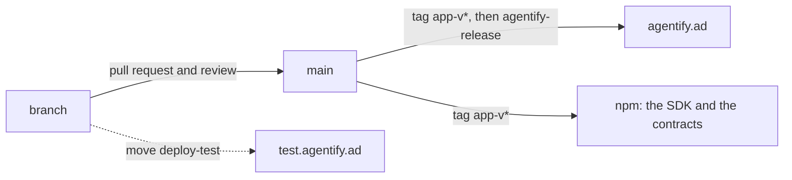

# Agentify

[](https://github.com/nuanu-ai/agentify/actions/workflows/ci.yml)
[](https://www.npmjs.com/package/@nuanu-ai/agentify)
[](https://www.npmjs.com/package/@nuanu-ai/agentify-contracts)
[](LICENSE)

Agentify is a site for the owner of an ordinary online business. They enter the
address of their shop and read what it exposes to AI agents — the robots file
and the sitemap, the structured data, the machine-readable output — as a report
of named checks with the evidence behind each verdict. Through the same site
they then sell their goods to those agents: the gateway behind it takes the
purchase, the agent pays in stablecoins over the x402 protocol, and the money
goes from the buyer's wallet to the merchant's without passing through us.

This file orients an engineer who has just opened the repository. What a
merchant reads is at [agentify.ad/docs](https://agentify.ad/docs/), built from
`apps/docs` here.

## Contents

- [The path through the product](#the-path-through-the-product)
- [Prerequisites](#prerequisites)
- [Run it](#run-it)
- [What happens in a sale](#what-happens-in-a-sale)
- [Repository layout](#repository-layout)
- [Checks](#checks)
- [Releasing](#releasing)
- [Where to read more](#where-to-read-more)
- [License](#license)

## The path through the product

A business owner arrives at the scanner, enters the address of their site and
watches the checks run. The full report is unlocked with an email address and
the one-time link sent to it. The same address is the key to the rest: the
report carries one control that opens the merchant cabinet, and the cabinet's
own door is that one field and that one link — there is no password and no
invitation code (ADR-0026). The cabinet then offers one control, and its press
creates the merchant and asks for the seller name buyers will see. That is the
only way an account or a merchant comes into being; no command at a server's
terminal makes either (ADR-0014).

From there the merchant's engineer takes over. The cabinet issues the key
their code calls with, the SDK publishes the product cards and runs a handler
beside the shop's existing API, and the first sale happens on the test
channel, where payments settle on Base Sepolia with test funds. Live
publication needs a seller name, a payout wallet and the operator's one-time
approval of that merchant; publication lists whatever is still missing. The
whole integration, from an empty project to a test sale, is the portal's
[quickstart](apps/docs/quickstart.md).

One origin serves all of it, on a laptop and on a server alike: the scanner at
`/`, the merchant documentation at `/docs`, the cabinet at `/cabinet`, the
merchant's own calls at `/v0` and the storefront an agent buys from under
`/x402`.

## Prerequisites

Node.js 24.21 — the exact version is in `.nvmrc`, and `pnpm install` refuses
another one because `.npmrc` sets `engine-strict`. pnpm 11.12 arrives through
Corepack from the `packageManager` field of the root `package.json`, the same
way CI gets it:

```sh
corepack enable
pnpm install
```

Installing also points git at `.githooks`, where a `commit-msg` hook holds the
Conventional Commits format. Docker with Compose v2 runs the stacks below, and
`pnpm test` needs a `python3` on the path for the scanner's operational tests.

## Run it

The stack is one command:

```sh
docker compose up --build
open http://localhost:8080
```

One origin, one port: the scanner at `/`, the merchant documentation at
`/docs`, the cabinet at `/cabinet`, the merchant's own calls at `/v0`, the
storefront an agent buys from under `/x402`, one Postgres behind them holding
a database for the commerce side and a database for the scanner. A merchant
process comes up beside it and publishes two cards — a rented phone number
sold synchronously, an eSIM sold asynchronously.

Nothing buys by itself. The buyer is the one thing that runs on the host rather
than in the stack, so the workspace needs its dependencies first:

```sh
pnpm buy                      # the first card in the catalogue
pnpm buy esim                 # the one delivered later
```

The gateway settles against nothing locally (ADR-0008): a purchase completes
with no wallet, no network and no faucet, and the first line of its log says so.

The cabinet is where a merchant sets the name buyers see and issues the keys
their own code calls with. Open `http://localhost:8080/cabinet/sign-in`, enter
an email address, and take the one-time link from the cabinet's log — the
local sandbox writes the message there instead of sending it. Pressing the
link's confirmation button signs you in, and the cabinet then offers one
button, "Open my merchant cabinet", whose press creates your merchant and asks
for the seller name. That merchant is a new one, and it is not `the_merchant` —
the merchant this laptop's stack seeds at start-up, whose two cards the
merchant process publishes and `pnpm buy` buys. A deployed channel seeds
nothing. Somebody who has just signed in has no cards and no keys of their
own, which is the truth about a merchant who has written no code yet
(ADR-0014).

If port 8080 is taken, `AGENTIFY_HOST_PORT=8090 docker compose up` moves the
stack and nothing else — the buy command runs on the host and needs
`GATEWAY_URL=http://localhost:8090 pnpm buy`.

The scanner is in that stack and answers the front page. Submit an address and
the worker behind it runs the scan; the report asks for an email before it
opens in full, and the scanner asks the cabinet to send the link over the
cabinet's private identity route rather than keeping a second account system.
That route is the cabinet's second listener on port 3002, which nothing
publishes, and the two processes that hold its shared secret are the only ones
that can use it. The message arrives in the cabinet's log like every other one
here, and it lands on the cabinet's page with one button. Pressing it opens the
one session the whole site has, the report and the cabinet alike, for thirty
days from the last visit; the scanner keeps no session of its own and asks the
cabinet whose a cookie is. A person becomes a merchant only by pressing the one
control the cabinet offers for it. ADR-0026 draws that boundary and ADR-0024
says what the scanner keeps of its own.

The scanner's tables live in the same database as the gateway's and the
cabinet's, `agentify`. A machine whose volume still holds them in a second
database, `agentify_scanner`, from before they moved, would come up with empty
scanner tables beside it, so it needs `docker compose down -v` once.

Editing the scanner is faster outside a container, and `pnpm scanner:dev` runs
its two processes on the host against the same database the stack uses — the
web application on port 3000, the worker's health endpoint on 8081. It reads
`.env.scanner` rather than the `.env` the stack above takes its settings from:

```sh
cp .env.scanner.example .env.scanner
docker compose up -d --wait postgres
pnpm scanner:db:migrate
pnpm scanner:dev
```

Nothing published on the host reaches the cabinet's identity listener, so a
scanner started this way scans and reports but cannot unlock one; that path is
walked in the stack.

## What happens in a sale

A card is one product written so that a program can decide to buy it: a title,
a description, a price, and the list of what has to be given at purchase. A
merchant publishes cards through the SDK, and every card is an address an agent
can pay against.

The purchase is an HTTP request to that address. The gateway answers `402
Payment Required` with a challenge naming the price, the network and the asset;
the agent signs a payment and repeats the request carrying it. That exchange is
x402, and the protocol itself comes from the official packages — what this
repository adds is knowing which order a payment is for.

The merchant's side is one process standing beside their existing API: a
handler. It listens on no port — it opens a single outgoing subscription and
receives paid orders, price questions and order events on that one stream
(ADR-0004). Everything it is written against is `@nuanu-ai/agentify`. The
package and the gateway agree on a contract version — `"2"` today — and a
change the package could not read moves that version before the gateway sends
it (ADR-0006).

The order is a state machine in `packages/core`, a pure function with no IO.
The gateway feeds it events and gets back the next state together with the
effects that state implies, and those effects are written down in the same
transaction as the state itself (ADR-0013). What the card declares before
payment is which sequence the sale follows. With synchronous fulfillment the
goods come back in the answer to the purchase and the money moves only once
the merchant has produced them, so a refusal costs the buyer nothing. With
asynchronous fulfillment the money moves at the purchase and the agent leaves
with an order identifier, which is the whole of its proof when it comes back
for the goods (ADR-0011). Fulfillment against the merchant's confirmation is
designed in the machine and refused at the door: a card asking for it is not
published, because the message that would tell the agent it may now pay does
not exist yet (ADR-0007). The portal's [orders page](apps/docs/orders.md)
draws each of the three, and its table of how an order can end is the test
suite's own fixture.

The stand is our own instrument for walking a purchase from all three seats —
catalogue, agent and merchant — in one local console, with a log threaded by
the order. It is not a product surface and it needs a throwaway buyer key in
`.env.stand` as `STAND_BUYER_KEY`; `pnpm stand` starts it on `127.0.0.1:8787`.
Its merchant half is written to be read by somebody integrating against the
SDK, in `packages/slice/src/stand-merchant.ts`, and
`docs/research/24-stand-boundary.md` says what it does and does not prove.

## Repository layout

One pnpm workspace holds all of it, on one toolchain and one lockfile. Biome
reads the JavaScript, TypeScript, JSON and CSS of every package — the Markdown,
the YAML, the shell scripts and the Python are read by no linter — every
package extends one compiler base and overrides it only where its runtime
differs, and one command runs every test that costs nothing. What needs a
database, a browser or the network is not in `pnpm test` and has a command of
its own.

| Path | What it is |
| --- | --- |
| `apps/web` | The scanner: the public site, the checks, the report. |
| `apps/scanner-worker`, `apps/browser-observer-actor` | The scanner's background process and its passive browser observation. |
| `apps/gateway` | The payment edge, the order runner and the queue. Ports in `src/ports`, their implementations in `src/adapters`. |
| `apps/cabinet` | The merchant's screens: sign-in, cards, orders, receipts, keys, and the identity route the scanner calls. Server-rendered, no client build (ADR-0005). |
| `apps/docs` | The merchant documentation, a VitePress site served at `/docs`. Its JSON examples are test fixtures (see below). |
| `packages/contracts` | `@nuanu-ai/agentify-contracts`: every shape that crosses a boundary, as zod schemas, and the route table both sides import instead of transcribing. |
| `packages/core` | The order state machine: pure logic, zero IO, zero runtime dependencies. |
| `packages/sdk` | `@nuanu-ai/agentify`: what a merchant integrates against. Its runtime tree is the contracts package and zod, and nothing else. |
| `packages/slice` | A mock merchant and a buyer, driving the offline gate, the `buy` and `smoke` commands, and the stand. |
| `packages/visual` | `@agentify/visual`: one stylesheet — the tokens, the base element rules and the shared primitives every surface on the origin is drawn with (ADR-0005 §6) — and under `public/`, the mark and the faces Caddy serves at `/assets` and `/styles`. No build step and no JavaScript. |
| `packages/scanner-contracts`, `packages/scanner-database`, `packages/scanner` | The scanner's private contracts, storage and evaluation engine. |
| `packages/analytics`, `packages/observability`, `packages/remediation` | The scanner's remaining packages, kept separate from the engine. |
| `deploy/` | Every Dockerfile, the Compose overlays for test and production, the Caddy route table, and the release: `agentify-release`, the activation script and the one Compose command line per channel. `deploy/README.md` is the release runbook. |
| `ops/`, `fixtures/` | The scanner's operational checks and runtime test inputs. |
| `scripts/` | The commands the root `package.json` calls: the decision-log check, the outside install, the mutation run, worktree hygiene. |
| `docs/decisions/` | The numbered decisions — what is expensive to reverse, and why it was decided that way. |
| `docs/research/` | The working material behind them: research, runbooks, acceptance protocols. |

One PostgreSQL, one database and one account for the whole product
(ADR-0003). The gateway and the cabinet each own their migrations under
`drizzle/`, and `pnpm db:migrate` runs both; the scanner's schema and
migrations live in `packages/scanner-database`, and `pnpm scanner:db:migrate`
runs them. Each set keeps a history table of its own in the schema `drizzle`,
so none of them mistakes another's entries for its own.

## Checks

```sh
pnpm check          # formatting and lint
pnpm typecheck
pnpm test           # offline, free, no network
pnpm check:decisions
```

That is the gate before a push. CI runs the same four on every push and pull
request, and beyond them the database suite, the build of every package and of
the portal, and the scanner's integration tests; the workflow is
`.github/workflows/ci.yml`. A green run publishes nothing and deploys nothing.

The portal's JSON examples and its tables of how an order can end are read by
the contracts and core test suites out of the very files the pages render, so a
page and the behavior it describes cannot drift apart quietly.

A few more checks cost something — a database, the network, or money — and are
kept apart for that reason:

- `pnpm test:db` needs a Postgres (`docker compose up -d --wait postgres`) and
  fails rather than skipping when there is none.
- `pnpm outside` packs the tarballs npm would publish, installs them into a
  directory with no path back here, and runs the commands the quickstart gives
  a merchant.
- `pnpm smoke:listing <https address>` asks Coinbase whether our resource would
  be listed, and reports no verdict rather than a pass when it cannot reach us.
- `pnpm smoke` walks the same buyer and mock merchant against the real
  facilitator on the Base Sepolia testnet. It refuses to start without
  `AGENTIFY_SMOKE=1`, is a dry run unless `--confirm` is given, and caps every
  payment at `SMOKE_MAX_USD`; the header of `packages/slice/src/smoke.ts` lists
  everything it needs.
- `pnpm mutate <package>` runs Stryker over one workspace package and prints
  the survivors. It is a triage tool for the hand-over ritual, not a gate.
- The scanner's own gates are `pnpm scanner:test:integration` and the migration
  half of `pnpm scanner:test:db`. Both need the same Postgres the database
  suite does (`docker compose up -d --wait postgres`) and take their connection
  from `.env.scanner`; like that suite they fail with words rather than
  skipping when there is no server. The other half of `scanner:test:db` is
  `drizzle-kit check`, which reads the migration files and no database at all.
  `pnpm scanner:test:actor` needs neither: it drives a Chromium, put there once
  with
  `pnpm --filter @agentify/browser-observer-actor exec playwright install chromium`.

## Releasing

Two channels, and the servers pull rather than being pushed to (ADR-0016). A
release is one command on the host, `agentify-release`, which reads the
commit's image digests from its image build, fetches the commit and runs its
`deploy/activate.sh`: a restore point, the migrations, the services, the
public routes checked. GitHub holds no server credential, and nothing in this
repository connects to a server.

| Channel | Address | What runs there | How a revision gets there |
| --- | --- | --- | --- |
| test | `test.agentify.ad` | any commit that was the head of a pushed branch | Move `deploy-test` to it: run **Deploy TEST** from `main` with a branch, tag or SHA, or push the pointer directly. A timer on the server picks it up within a minute of its images being built. |
| production | `agentify.ad` | the stable release | An administrator tags a commit of `main` whose CI and image build succeeded `app-v<release>`, and a person with mesh access runs `agentify-release app-v<release>` on the server. |



```sh
git push --force origin my-branch:refs/tags/deploy-test          # test
git tag app-v<release> && git push origin app-v<release>         # production: the tag,
ssh -t agentify sudo agentify-release app-v<release>             # then the release
```

There is one test channel and it is shared. Before moving `deploy-test`, ask
the other person whether they are on it; most work is done locally and a test
redeploy is rare, so this is a sentence rather than a queue. What a server
runs, and what failed there, is recorded on that server and not in GitHub. A
failed test revision is not retried by the timer; a person runs
`agentify-release` again on the server once the cause is fixed.

The same `app-v*` tag publishes the SDK. `@nuanu-ai/agentify-contracts` and
`@nuanu-ai/agentify` are released together: every change to either carries a
Changeset (`pnpm changeset`), a release is prepared on `main` with
`pnpm changeset version`, and the publish workflow on the tag waits for CI on
that exact commit, publishes whatever versions the manifests carry and the
registry does not yet hold through npm Trusted Publishing with no stored token,
and installs them back from the registry to prove it. The number in the tag is
the application's and says nothing about the SDK version, so a tag whose SDK
version is already public publishes nothing. The
procedure, including the one-time bootstrap of the package names, is
[`docs/research/22-sdk-release.md`](docs/research/22-sdk-release.md); the
operator's side of both channels is the
[release runbook](deploy/README.md).

Switching a merchant on for live sales is an application command rather than a
deployment: `pnpm approve <email>` from the operator's checkout reaches the
production host over SSH, resolves the cabinet account's merchant and records
its one-time approval, and it says so when the approval already exists or the
account is unknown. Approval publishes nothing and supplies no missing seller
name or payout wallet; the test channel never needs it.

Starting an address over is a command for the test deployment only:
`pnpm forget <email>` from the operator's checkout reaches the test host over
SSH and removes that address's cabinet account together with the merchant it
names, the merchant's keys and cards, and the wait before the address's next
sign-in link, so the address signs in again as if for the first time. It
refuses, and says why, when the merchant has an order or a receipt, when
another account names the same merchant, or when no account has the address;
on a deployment whose payment network is live it refuses before it reads
anything. An operator flag goes with the account, and a WooCommerce
connection it drops keeps its key in that shop until somebody revokes it
there.

## Where to read more

- [`apps/docs/`](apps/docs/) — what a merchant reads: the owner's decision, the
  engineer's integration, the operator's questions. Published at
  [agentify.ad/docs](https://agentify.ad/docs/).
- [`packages/sdk/README.md`](packages/sdk/README.md) — the npm page of the
  merchant SDK, and [`packages/contracts/README.md`](packages/contracts/README.md)
  the same for the contracts.
- [`docs/decisions/`](docs/decisions/) — what is expensive to reverse, and why
  it was decided that way.
- [`AGENTS.md`](AGENTS.md) — the working discipline: how decisions are
  recorded, what a test has to answer for, why a check that did not run never
  reports success.

Engineering artifacts are written in English; research and product documents in
the language of their readers, which is why some of the above is in Russian.

## License

Agentify is licensed under the Apache License 2.0. Distributions must retain
the notices required by that license, including the attribution to Nuanu AI in
[`NOTICE`](NOTICE). See [`LICENSE`](LICENSE) for the license terms. The scanner
was imported from `nuanu-ai/agent-first-project` at commit
`33f3385d2be825022133b55d889f8a690f736e69` under the same terms, without its
private research, local configuration, secrets or source history.
