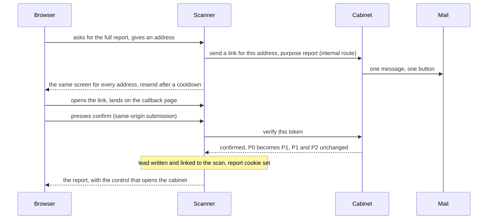
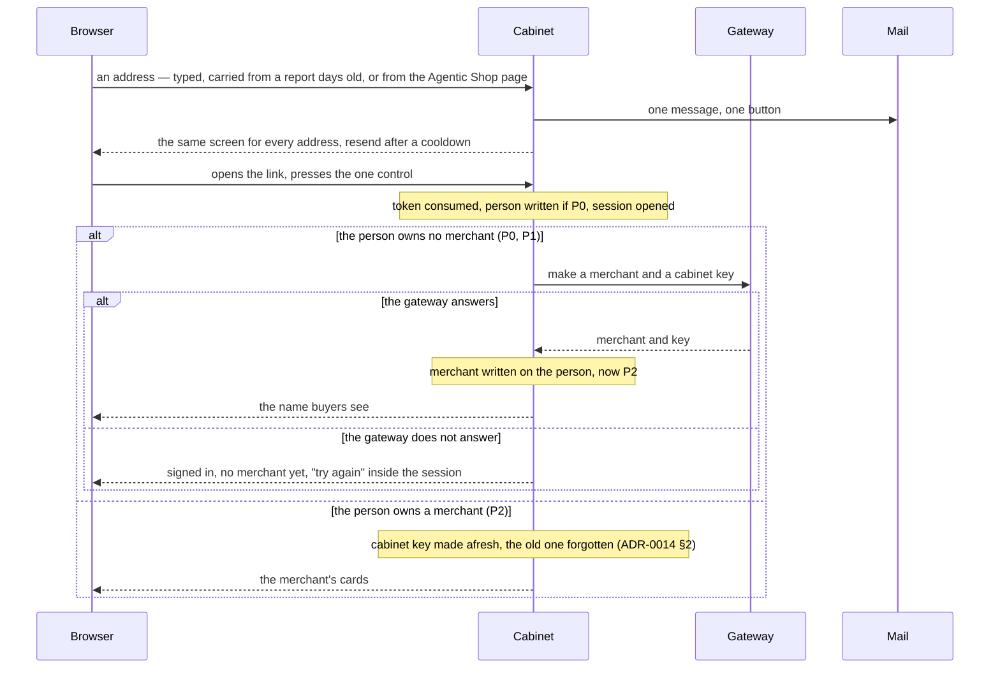

# 0026. One way in: an address and a one-time link, on both doors

Date: 2026-09-17
Status: accepted (Dmitry, 2026-09-17: "средство аутентификации у нас —
ссылка из письма"; the scanner's confirmation is trusted at the cabinet's
door, his word of 2026-09-16)

## Context

Two surfaces, two ways in. The scanner signs nobody in: an address and a
one-time link open a report, and a thirty-day cookie remembers that. The
cabinet asks for an address, a password and an invitation code typed by hand;
confirming the address is optional and buys only recovery, so an unconfirmed
account with a lost password is recovered by us at a terminal. Nothing links
the two. A person who has just confirmed an address at the scanner types it
again at the cabinet, invents a password nobody asked for, pastes a code, and
is asked to confirm the same address a second time — because the cabinet does
not trust a confirmation the same operator made a minute earlier, on the same
host, with the same pinned component and the same sender (ADR-0009, ADR-0024).

ADR-0014 §3 named the day the invitation retires: when a confirmed address
replaces it. Dmitry settled the shape: the product has one means of
authentication, and it is the link.

## Decision

**1. One means of authentication on both doors.** Whoever can read mail at an
address is the person of that address. There is no password and no invitation
code. Typing an address at either door sends one message with one button;
opening it lands on a page of ours with one control, and only that same-origin
submission consumes the token, so a mail preview cannot spend it. The token is
hashed at rest, single-use and short-lived — the construction the scanner has
already. Signing in and recovering access are the same act, and no case is
left that needs a person at a terminal.

**2. One identity, held by the cabinet; a link is still written for one
door.** The person of an address is one row, in the cabinet's component and
the cabinet's database, and the scanner has no identity tables of its own.
When the scanner needs a link sent or a token verified it asks the cabinet
over the internal route of paragraph 3, and what it keeps is report access
alone — a capability bound to a lead, not a person. A person may own a report
and no merchant: the merchant and its key are attached the first time that
person's link is consumed at the cabinet's door (paragraph 4). The scanner's
link opens a report and the cabinet's opens the cabinet; no session is shared,
each application keeps its own, and no cookie widens past the cabinet's path
(ADR-0009 §6). ADR-0024's separation stands for scans, reports and leads and
is edited for identity in this same change. On one origin (ADR-0005 §1) every
link the scanner shows is a same-origin navigation.

**3. The cabinet trusts the scanner's confirmation at the moment it happens.**
When the scanner has just confirmed an address, it asks the cabinet — over the
internal route it uses for its own links, reachable only on the compose network
and authenticated by a secret the two processes share — to issue a link for
that address instead of mailing it. The report's **Open your cabinet** control
submits only the report path and confirmed address to one same-origin cabinet
entry POST. This explicit click opens the cabinet; there is no second confirmation
page, second email or repeated address entry. The token has the same cabinet
purpose, single use and lifetime as a mailed cabinet link. After report
confirmation the scanner puts it in one host-only `HttpOnly`, `SameSite=Strict`
cookie scoped to `/cabinet` for no longer than that one-hour lifetime. The value
is authenticated with the private scanner-to-cabinet secret and binds the
normalized address, exact report, token, issue time and expiry. It is absent
from the response body, report page and form. One newer handoff replaces an
older one; an ordinary reload does not lose it. The cabinet clears it after
every entry decision and on sign-out. It grants no report access, widens no
cabinet session and cannot renew one. Rendering the report never submits it
automatically. Mailed links still land on a page with one explicit confirmation,
so mail previews cannot consume them. If that exact registration or recovery
link is opened again while its exact state-to-report mapping is still retained
and a matching report session is live, the scanner opens that report directly
without another confirmation and without consuming or reissuing the mail token.
Without that matching session, first use still requires confirmation and an
expired or refused token leads to recovery. Session lookup never substitutes a
different or latest report for an unknown, foreign or ambiguous state. Email
recovery may use the owner's latest report only when the supplied state is truly
unknown or retired, and only a newly mailed recovery token proves access; a
known state for another owner remains refused. Exact intent evidence is retained
for seven days, while report sessions last up to thirty, so this repeat-link
shortcut is bounded by the shorter retained mapping and does not extend PII
retention. Pressed later, from a report cookie days
old, the same control first uses a live cabinet session only when its address
matches the report, then a valid fresh handoff. With neither it opens the
ordinary email form, already filled with the report address; mail is sent only
after the person explicitly asks there. A report cookie is a right to read a
report, not proof that anybody is at the mailbox.
The assertion crossing the boundary is "this address was confirmed now, by
us", it crosses through one route that answers only the scanner's process,
and nothing on the public origin can ask for a link to be returned rather
than sent.

Report, recovery and cabinet emails use one Agentify visual template and sender
identity. Their text and destination describe the requested action; separate
token purposes do not create separate product brands or extra confirmations.
This is the product correction requested on 2026-09-18: one mailbox confirmation
opens the report, then one cabinet click opens the cabinet.

**4. The merchant is made when the link is consumed at the cabinet's door.**
The token is consumed first, and the person's row and session are written
with it — that is what the component does at verification, and the address
is confirmed by construction. Only then is the gateway asked for the merchant
and the key its cabinet calls with, for a person who owns none. A gateway
that does not answer leaves a person signed in without a merchant, who tries
again from inside the session; no link is spent on a retry. A cabinet that
fails after the gateway answered leaves a merchant nobody names — litter, as
ADR-0014 §1 says — and the next attempt makes another. A person who owns a
merchant signs into it. A message that never arrived leaves nothing behind,
and registering is the same screen as signing in.

**5. The door to the shared catalogue moves from registration to live
publication.** Anyone who reads their mail holds a cabinet, integrates against
the SDK and sells in the test contour. Live publication is refused until the
merchant has a seller name and a payout wallet, as today, and until the
operator has switched that merchant on, once. The named trigger for the switch
becoming a paid subscription is the day the operator cannot keep up.

## The stories

Every way a person can arrive, what they hold, and where they end. P0 is an
address the cabinet has never seen, P1 a person who owns no merchant, P2 a
person who owns one. Each row is an acceptance case the scanner's and the
cabinet's suites answer for; a row with no test is a gap in the code, not in
the table.

The scanner's door: the full report.



From the report into the cabinet, in the request that confirmed the address.

```mermaid
sequenceDiagram
    participant B as Browser
    participant S as Scanner
    participant C as Cabinet
    Note over S: the address was confirmed in this same request
    S->>C: issue a link for the cabinet's door (internal route)
    C-->>S: the link, not mailed
    S-->>B: sets a signed one-hour HttpOnly handoff cookie for /cabinet
    Note over B: the report form contains only its path and confirmed address
    B->>C: presses Open your cabinet, same-origin POST carries the cookie
    Note over C: matching session first; otherwise verify the exact handoff
    Note over C: continues as the cabinet's door, from "token consumed"
```

The cabinet's door: the one field, and the link it sends.



Every way in.

| Where the person is | Who | What they hold | What happens | Ends at |
|---|---|---|---|---|
| scanner, asks for the full report | P0, P1, P2 | nothing | first diagram | the report; P0 is now P1 |
| scanner, report opened within thirty days | any | report cookie | the cookie is read; no mail | the report |
| scanner, cookie gone or expired | any | nothing | "recover": address, link mailed for the report; one answer for every address | the report, after the link |
| report, control pressed right after confirming | P1 | a confirmation in this request | second diagram: token issued, not mailed; one explicit POST, no intermediate confirmation; ordinary reload preserves it until expiry | the cabinet, name screen; now P2 |
| the same | P2 | the same | second diagram | the cabinet, cards |
| report, control pressed days later | P1, P2 | report cookie; perhaps a matching cabinet session | a matching cabinet session opens it; otherwise the prefilled cabinet door asks before mailing | the cabinet, directly or after the link |
| Agentic Shop page, control pressed | any | nothing | the cabinet's door, address typed | the cabinet, after the link |
| any public header of the scanner, Cabinet pressed | any | perhaps a cabinet session | a live session is sent to its cards without a question; otherwise the one field | the cabinet, directly or after the link |
| cabinet, the one field | P0 | nothing | third diagram: person, merchant, key | name screen |
| cabinet, the one field | P1 | nothing | third diagram: merchant, key | name screen |
| cabinet, the one field | P2 | nothing | third diagram: signs into the merchant | cards |
| cabinet, any page | P2 | cabinet session | in; no mail | that page |
| cabinet, session expired or signed out | P2 | nothing | the one field | as above |
| arriving from another site, e.g. WooCommerce's return | P2 | a session the browser does not send (SameSite=Strict, ADR-0009 §6) | the page above the gate says so and offers the one field | settings, after signing in |
| migrated account, first visit after the switch | P2 with a password on file | nothing; sessions ended at the switch | the one field; no password is asked; this sign-in confirms the address | cards |

What a link does.

| The link | Answer |
|---|---|
| valid, first press | consumed; the story continues |
| pressed a second time | refused, "this link has been used", and the one field to ask for another |
| past its lifetime | refused the same way |
| for the other door — a report link at the cabinet, or the reverse | refused the same way; a token says which door it is for |
| opened by a mail preview or a security scanner | nothing; only the same-origin press consumes it |
| two links asked for | each is valid once until its own expiry; asking again cancels nothing |
| malformed or unknown | refused the same way; no answer says whether the address exists |

When mail cannot go, or a process is down.

| What failed | What the person sees |
|---|---|
| the address does not exist or bounces | the same screen as success; nothing arrives; resend after the cooldown |
| the mail provider refuses or is down | "temporarily unavailable, try again shortly" — the honest 503 the scanner answers today |
| the cabinet is down | at the scanner the same 503 for asking or verifying, while reports already opened keep opening; at the cabinet nobody signs in until it is back |
| the gateway is down at the cabinet's door | signed in without a merchant, offered to try again (third diagram) |

Publication and deletion.

| Story | Answer |
|---|---|
| publish on the test channel | needs the seller name; no wallet in the sandbox (ADR-0019); no switch |
| publish live | refused with a list of what is missing: seller name, payout wallet, the operator's switch (§5) |
| deletion asked at the scanner, P1 | lead and report sessions removed; the cabinet is asked to remove the person; the row is gone |
| deletion asked at the scanner, P2 | lead and report sessions removed; the person stays, since a merchant is removed by rules not built (ADR-0014) |

## Consequences

Out: the password and everything that existed for it — its derivation, the
change, forgot and new-password screens, the reset message, the unconfirmed
state and its banner, and the sentence that sends a merchant to whoever gave
them the address of this site. Out: the invitation typed by a person and the
register screen. The gateway's registration route keeps its code as a value in
the cabinet's configuration: it guards the wire between two processes of ours
and is no longer a door for people. The account command keeps making an
account for a merchant that already exists — the seeded one — and stops
printing a password. Existing accounts lose their passwords and keep their
merchants and data; their sessions end at the switch, and an address that was
never confirmed is confirmed by its first sign-in through a link, not declared
confirmed by the migration.

Out, one step later: the scanner's own instance of the component and its
identity tables, retired once the route carries the scanner's links — later
rather than at once, so that at no point does the scanner depend on a cabinet
that still holds passwords.

In: the magic-link plugin in the cabinet, inside the Better Auth already
pinned in the tree, so the dependency tree gains nothing; one internal route
on the cabinet with four verbs — send a link for the scanner's door, verify
its token, issue a link for the cabinet's door, and remove a person who owns
no merchant when the scanner is asked to delete; one secret in two
deployments;
a control in the report and the same control on the Agentic Shop page, in
place of the application form. The token is consumed in the cabinet and the
lead is written in the scanner, which is not one transaction: verify first,
then write, idempotent on the token, so a token verified and never turned
into a lead is finished by the same click or expires unharmed. A deletion
request at the scanner revokes report access, removes the lead and, for a
person who owns no merchant, the person's row; a person who owns a merchant
is removed by the merchant's own rules, which are not built (ADR-0014).

What it costs, said on the door: the mailbox is the whole key. A person who
loses the mailbox loses the cabinet, and no second route is pretended here.
Delivery becomes the single point of failure of the way in — measured, with
the resend on the same screen. Somebody reading a merchant's mail is that
merchant, and a shared mailbox is a shared cabinet. This decision sets the
floor and names the ceiling as its second stage, agreed in principle by
Dmitry on 2026-09-17 and detailed later: a second factor that does not live
in the mailbox, optional and not a condition of live publication, and a step
above the session on the actions that move money, beginning with
the payout wallet, whose change writes to the address and can be undone from
the message. Until that stage lands, none of it is assumed to exist, and the
work is tracked as such. One identity in one process is one process
whose absence stops every sign-in: when the cabinet is down nobody gets a link
at either door, and reports already opened keep opening. ADR-0009 §5 and its
consequences, ADR-0014 §1, §3 and its consequences, ADR-0024's identity
paragraphs and ADR-0005 §1 and §5 are edited in this same change.

Rejected: **login and password mailed to the person** — a secret in plain text
in a mailbox, in mail logs and in forwarded threads, chosen by nobody, doing
what the link already does. **One session for both applications** — buys the
client nothing they can see, and a cookie wide enough to serve both rides on
the money path. **Two identity stores kept** — every feature that has to know
a person is then written twice, and a privacy deletion has two places to miss.
**A second message at the transition** — proves the same address the same way
a minute later; the boundary is held by minting only at confirmation. **The
password kept as a second factor** — a factor recovered through the same
mailbox is not a second one; passkeys are the honest version and belong to the second
stage. **Trusting the report cookie** — a thirty-day cookie
on a shared laptop would open a cabinet in somebody else's name. **The
invitation kept as a hidden door** — held by the cabinet for everybody it
stops nobody; the door belongs where a stranger's words reach a buyer, which
is publication.
