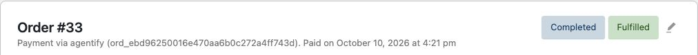
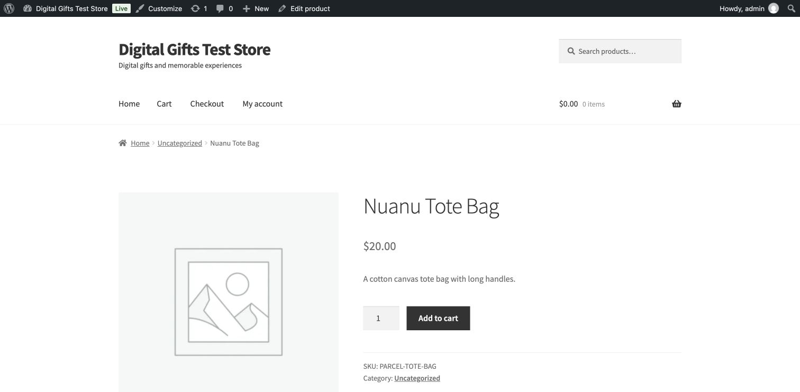

# Manual test run, 2026-10-10

This run follows [the manual test plan](42-manual-test-plan.md). All nine blocks were attempted. Partial rows identify missing evidence and are not acceptance passes.

## What was tested

- TEST runtime and deployment tag: `ec1433d865267db4711b0f040c00a8f230505f50`
  (`app-v0.9.0`), verified from the test host before execution.
- LIVE runtime for G: `9c8f6f863d8e60f87e9fc8f77d76cfecab30b19d` (`app-v0.8.0`).
- Local stack source: `bbda8670229b31d2f81f634060163069b7b9f66a` (`main`).
  Its only change from the TEST revision is the manual test plan itself.
- npm packages installed during the cold path: SDK `0.4.0`, contracts `0.8.0`,
  zod `4.6.5`.
- Node.js `24.21.0`. Product browser: Codex built-in browser; Chrome provides
  access to QA email and independent sessions. Mobile checks use a 375-pixel
  viewport; this is not physical-phone evidence.
- Recorded manual execution: 2026-10-10, 07:23:50–08:58 UTC, followed by report review. Preflight and release/access checks precede the recorded cold-path clock.
- QA lead and separate AI testers. The cold tester receives only Block A's
  action column and public documentation. Timings describe an AI-assisted
  run, not a measured human engineer's integration time.
- The product owner authorizes autonomous TEST operations and Block G on
  2026-10-10. Block G includes a dedicated production account and no purchases;
  its key was revoked and its pending wallet change cancelled after use.
- Purchases use a dedicated Base Sepolia wallet. The cumulative ceiling is
  60 test USDC, with 0.01 per SDK purchase and 27.50 per WooCommerce purchase.
  The verified starting balance is 20 test USDC. No mainnet purchase is in scope.
- QA local services use a separate Docker Compose project and database port;
  existing local services and shared TEST merchants are preserved.

## Verdict

**Not ready for the first merchant we do not control.** Findings 1 and 13 are open S1 findings under the registered scale: an accepted card update can break a paid order, and an accepted price-check URL is silently ignored where money is involved. Finding 1 was reproduced independently twice. WooCommerce findings do not determine SDK-stage acceptance. Partial rows and the older LIVE release limit the conclusions; automated green results do not override the observed failures.

The matrix contains **145 cases: 130 Pass, 9 Fail and 6 Partial**. No case is left Blocked or Not run. The six partial rows retain specific unavailable or missed subcases; they are not counted as passes.

## Cases

| Case | Verdict | Evidence | Findings |
| --- | --- | --- | --- |
| A-01 | Pass | Home → selling page → Docs, with separate owner/engineer navigation. | — |
| A-02 | Pass | Owner recall recorded before rereading; money, pilot scope and pause understood. | — |
| A-03 | Pass | Real email → confirmation button → merchant creation → seller-name choice. | — |
| A-04 | Pass | Wallet saved after operator supplied a new empty QA address; newcomer had no documented wallet-creation path. | 2 |
| A-05 | Partial | One csk_test_ key, reload leaves one key; copy-button clipboard could not be verified through automation. | — |
| A-06 | Pass | Exact npm install: SDK 0.4.0 → contracts 0.8.0 → zod 4.6.5, no wallet libraries. | — |
| A-07 | Pass | Runnable .mjs file and Node environment-file command chosen using ordinary Node knowledge absent from the recipe. | 3 |
| A-08 | Pass | Published item_52839048e9794a67945daf0b5804a9b3; Cards shows immediate delivery. | — |
| A-09 | Pass | One handler, TEST startup warning, zero problem events; delivery is an explicit QA fixture. | — |
| A-10 | Pass | Exact verify command exits 3: card complete, idempotency not run. | 4 |
| A-11 | Pass | Assigned operator bought after receiving catalogue ID; docs expose no request route for an unassigned signup. | 5 |
| A-12 | Pass | ord_47043ef918cc46adafae0b3e2b95c148; rcp_b9072738449c4d92b470078360533b40; buyer, SDK, UI and chain agree. | — |
| A-13 | Pass | ord_a5e27e94a4e94638bd67ecae05e64504; rcp_33c8ffe5cbc5432bbdcb0a7ef7e7d26c; accepted, then delivered in a separate call 84.19 s after handler receipt; chain evidence proves payment preceded delivery. | — |
| A-14 | Pass | Gross clocks, assistance, questions and learned concepts recorded in the cold account. | — |
| B-01 | Pass | Blind agent found no real offer; standard discovery routes do not point to /x402/catalog. | 6 |
| B-02 | Pass | Catalogue lists on-sale cards and the declared title, description, price, mode, inputs, result and seller. A paused card disappears. The completed cold reader identifies an omitted async deadline as unknown, cannot infer the default day, and treats seller identity as asserted rather than verified. These record-only questions have now been answered; their uncertainty remains an AX observation. `B-02-catalog`, `B-02-paused-catalog`, `B/b15-transcript.md`. | — |
| B-03 | Pass | GET probe returns 402 without creating an order; decoded challenge names Base Sepolia, USDC, amount 5,000,000, the local stand-in payee, and POST discovery. `B-03-probe.json`. This is LOCAL challenge evidence, not a real transfer. | 11 |
| B-04 | Pass | Stand challenge then signature buys the same order; the unpaid order was shown before signing. `ord_5380a9ef03c54bf39933adb7b160b2c0`. | — |
| B-05 | Pass | Synchronous purchase returns goods and a settlement header, then all three views show delivery with one receipt. `rcp_d5389c31965642ca858eb5505a67ae26`. | — |
| B-06 | Pass | Final TEST order ord_8d39d61ba03040f79c7da70a2520336c was captured before signing, after acceptance with no goods/settlement header/receipt, and after on-time delivery in 30.53 s with one receipt rcp_d68e86bf9ef740d685fe64f278f7b0a7. Buyer, SDK and actual IAB agree; a separate machine reads the delivered status and goods without auth. All three surfaces project both unpaid and accepted work as in_progress; it does not itself prove payment. Earlier late-delivery and settlement-failure attempts are retained below. `B06F-*-browser.txt`, `B06-final-*-views.private.json`. | 30 |
| B-07 | Pass | All ten HTTP/error-envelope branches ran. A fresh reader interpreted all ten actual bodies with no code or plan and selected appropriate corrections or stop/reconciliation, without blindly retrying a non-retryable request or inferring payment guarantees. The earlier three-body transcript is supplemented by `B/b07-ten-errors-transcript.md`; no missing interpretation remains. Undeclared-field errors name the field despite an empty problems path. | — |
| B-08 | Pass | A paused card with invalid parameters returns 422 first; corrected parameters then get 409 not_selling. Each message accurately names the encountered constraint, although finding both takes two requests. | — |
| B-09 | Pass | Unreadable payment returns a fresh 402 challenge and an empty body. The reason appears in the decoded payment-required header; a body-only reader gets no explanation. This is the registered behavior and a recorded AX limitation. | — |
| B-10 | Pass | Replaying the same authorization to the same order returns its delivery and leaves exactly one matching receipt. `ord_2eb6bb6a004b4a62bb4b16cfb6a69e50`. | — |
| B-11 | Pass | Reusing the old payer/nonce with a new order offer returns 409 payment_already_spent and no matching receipt. `ord_cbbce9bd95bd46e3896a9498b589de1a`. | — |
| B-12 | Pass | A different payer for the delivered order gets 409 not_this_purchase; the original goods and sole receipt remain. | — |
| B-13 | Fail | Real TEST old-recipient signature returned 409 payment_not_verified after the wallet changed. Buyer balance stayed 11.98; no receipt or handler arrival. Original payout restored with pending:null. Unpaid browser/SDK/status captured; the order later expired normally. Refusal does not tell the agent to take a fresh price, so the recovery part of the expectation fails while the no-charge boundary holds. `ord_b760aa7f12b1456c8b91e98ec2853272`, `local-cases/test-b13-b06/`. | 28 |
| B-14 | Pass | Handler refusal reaches buyer status with the chosen code and exact message; no matching receipt. Prior delivered statuses contain no refusal. `ord_ad4bc622d1ee4580a714ef8b43bce373`. | — |
| B-15 | Pass | Fresh model read only actual payloads; conservative unknowns and correct actions for all three errors. Transcript retained. | — |
| B-16 | Pass | Reuses A-12/A-13 real TEST purchases: official Base Sepolia USDC, 0.01 each, seller received both. | — |
| C-01 | Pass | Reuses B-05: immediate delivery, three final views, one receipt. | — |
| C-02 | Pass | Handler out-of-stock refusal closes the order with the chosen words and no receipt. | — |
| C-03 | Fail | A handler configured to wait 9.5 seconds returned a delivered purchase in 9,591 ms despite the documented eight-second synchronous deadline. The isolated repeat expired in 9,076 ms. This is a deadline-claim finding, not proof of lost goods or duplicate money. `C-03-*`, `C-03I-*`. | 9 |
| C-04 | Pass | Two malformed deliveries are refused with missing-field problems. The order expires in 8,801 ms with no receipt. | — |
| C-05 | Pass | Synchronous acceptance is refused as not_applicable_in_mode; one handler arrival and expiry in 9,130 ms, no receipt. A later stand answer does not issue one. | — |
| C-06 | Pass | Explicit stand delivery was sent at approximately 5,018 ms and the purchase completed in 5,057 ms, with one arrival and one receipt. Two earlier browser attempts around 8.3 seconds are excluded from the five-second evidence. | — |
| C-07 | Pass | The active SDK handler throws twice, about 3.63 seconds apart, with both errors reported locally. The order expires with no receipt. The initial detached-process launch failure is a harness issue and is excluded. The plan's estimate of about three attempts is not an exact minimum. | — |
| C-08 | Fail | Two runs expire after one handler arrival; another delivers on its second arrival with one receipt. The registered unconditional success expectation does not hold. Public retry documentation is deadline-bounded, so this alone does not establish a promised minimum of two arrivals. The unqualified SDK message does make a separate false retry promise, described below. `C-08-*`, `C-08R-*`, `C-08I-*`. | 8 |
| C-09 | Pass | An order bought with no active handler expires in 8,370 ms with no receipt. Starting the handler afterward does not revive it or deliver it. This reuses the initial inactive-handler C-07 harness purchase, whose actual condition fits C-09. | — |
| C-10 | Pass | A holder is killed 68 ms after payment begins. Its replacement receives the order and completes delivery in 5,502 ms, with one receipt. Only the merchant process was controlled. | — |
| C-11 | Pass | After C-03I expires and its late goods are stored, another payer is refused. A fresh authorization from the original payer releases those goods once, without another handler arrival. | — |
| C-12 | Pass | Handler price 1.23 replaces catalogue price 3.00; challenge, order, receipt and price-as-of agree. A quote that aged 36 seconds during browser orchestration is excluded; the immediate C-12R rerun supplies the positive evidence. | — |
| C-13 | Pass | Unavailable quote closes before payment with price:null, no refusal words and no order-handler call. SDK returns order_closed_before_it_was_priced; dashboard explains why pre-price orders are omitted. | — |
| C-14 | Pass | Silent synchronous quote falls back to the card price after the five-second price window. The delayed stand worker then delivers once. | — |
| C-15 | Pass | A price handler delayed 9.5 seconds causes the async purchase to be rejected after 5,050 ms, price:null, with no order-handler call or charge. | — |
| C-16 | Pass | A forty-second-old challenge returns 409 expired, with no new challenge, charge or handler call. The case asks the tester to record the exact response and therefore passes; the public fresh-price claim is a separate finding. | 10 |
| C-17 | Pass | Reuses B-06: accepted purchase is in progress without a receipt, then delivered with one receipt. | — |
| C-18 | Pass | Async refusal produces refund_due, the chosen refusal code/message, an event and no receipt. Buyer, SDK and dashboard agree. | — |
| C-19 | Pass | Stand refusal approximately one second after acceptance creates refund debt before the ten-second deadline. An earlier browser attempt crossed that deadline and is explicitly reused for C-20. | — |
| C-20 | Pass | Accepted order left without delivery reaches refund_due; event, open-order list and absence of receipt agree. | — |
| C-21 | Pass | Browser Owed / Deliver now closes C-20 debt. Buyer receives goods, one receipt is issued, and the delivery result says debt_closed_by_delivery. | — |
| C-22 | Pass | Repeated delivery returns ok:true/already_delivered. Buyer retains the first goods and one receipt. | — |
| C-23 | Pass | Wrong goods return delivery_does_not_match_card, three problems and retryable:true, leaving the order unchanged; corrected goods deliver once. Starting state was refund_due rather than in_progress. | — |
| C-24 | Pass | A 600-second async card gets exactly five failed arrivals at approximately 0, 4.97, 9.49, 16.50 and 24.52 seconds. Refund event follows at 28.45 seconds, with no receipt. Attempt exhaustion before the delivery deadline is publicly documented. The fifth SDK problem still promises another arrival; that belongs to the retry-message finding. | 8 |
| C-25 | Pass | Acceptance takes approximately 4,005 ms. No repeat arrives, so the conditional post-accept throw branch does not execute. The accepted order remains in progress beyond the observed attempt-exhaustion interval and is subsequently fulfilled. This is not direct runtime coverage of a post-accept failure arriving. | — |
| C-26 | Pass | The accepted C-25 order survives worker termination and restart, appears in the SDK open list, and is delivered once through orders.forId. | — |
| C-27 | Fail | The literal short-deadline plan expectation does not hold: both abrupt stop and awaited SDK.stop can leave a poll that consumes the later refund event before restart. This is the documented event-loss condition, not an undisclosed durable-event promise. A sixty-second control outlasts the old poll and receives exactly one event after restart. Open-order debt remains in every variant. The control's final debt browser view was not captured; shorter-variant debt views and all API control responses are preserved. See the plan correction below. | 12 |
| C-28 | Pass | Two five-second workers still produce one delivery and one receipt. The initial run reached both workers but shutdown interrupted the second answer; it is not counted as completed duplicate-answer evidence. The complete rerun sees one arrival and one receipt; a duplicate arrival is permitted, not required. | — |
| C-29 | Pass | Browser pause removes the card from the catalogue and refuses GET/unpaid POST with not_selling and no challenge. Resume restores catalogue and 402 probe. | — |
| C-30 | Pass | Accepted order remains open while its card is paused and delivers once. Reuses the recorded C-25/C-26 order. | — |
| C-31 | Pass | Pause all sales hides/refuses the three then-existing handler cards and preserves fulfillment of an accepted order. Resume restores them. A fourth fixture published later is outside that assertion. | — |
| C-32 | Pass | A pre-pause challenge completes with goods and one receipt; new unpaid purchases stay refused. Completion is an allowed C-32 outcome. The same 9.5-second late-handler behavior corroborates C-03's deadline claim finding. | 9 |
| D-01 | Pass | Missing name+wallet gives `card_rejected`, retryable false, both findings with empty paths on TEST; LOCAL requires name only. `D/readiness-test.json`, `D/readiness-local.json`. | — |
| D-02 | Pass | Five missing-field cards refused with field paths. Four use generic type-language; result has authored prose. `D/schema-results.json`, missing-field fixtures. | 17 |
| D-03 | Pass | Markup/entities/control characters and `List<String>` refused. `Tea & coffee`, `AT&T`, `5 < 10`, `Map<String, Integer>` published and read back unchanged. `D/D03-exact-titles.json`, schema results. | — |
| D-04 | Pass | Server accepts 500, refuses 501, counts 499 ASCII characters plus an emoji as 501, refuses blank. CLI mismatch recorded separately. `D/cards/length-*.json`. | 15 |
| D-05 | Pass | Invalid price spellings refused; USDC object and 0.001 USD accepted. Smallest live payable amount remains unmeasured and publication gives no warning. No sub-cent payment attempted. | — |
| D-06 | Pass | Confirm/unknown mode/sync deadline refused. Confirm says unavailable during pilot; unknown enum uses generic validator prose. | 17 |
| D-07 | Pass | Empty result/unsupported parameter type refused. Undeclared implementation-needed input cannot be inferred and is accepted. Cold reader saw the warning in quickstart before sale. | 17 for parameter prose |
| D-08 | Pass | Six tags, overlong tag, non-ASCII, padding and case duplicates refused. Empty list also refused: omit the field instead. | — |
| D-09 | Pass | Custom price-check URL accepted with no warning; LOCAL sync purchase delivered at card price; no listener connection observed. Source correlation confirms URL checks cannot reach the merchant. `D/D09.json`, `D/D09-views.json`. | 13, documented |
| D-10 | Pass | `accepted({eta_seconds:60})` accepted; no ETA in buyer/SDK/dashboard, no problem callback warning. `D/D10.json`, `D/D10-accepted-views.json`. | 14, documented |
| D-11 | Pass | Reprice retains catalogue ID; new catalogue/dashboard price 0.02; old order and receipt retain 0.01. `D/D11-*`, catalogue in `D/E11-dynamic-seller.json`. | — |
| D-12 | Pass | Requested behavior recorded: same-card result republish accepted, original promised goods refused, then refund_due. Three views agree. Original evidence preserved. | 1 |
| D-13 | Fail | 31 refused-card checks: 30 agree and exit 1; emoji boundary reports completeness and exits 3. No file: 3, unknown command: 2, unreadable: 2, non-JSON: 1 with whole-card finding. | 15 |
| D-14 | Pass | No key/no scheme fail at construction; no origin fails on first call naming both sites. HTTP and origin+/v0 build; dummy-key HTTP yields 401, doubled/v0 path: 404. No real key sent over HTTP. `D/client-results.json`. | — |
| D-15 | Pass | Wrong-channel prefix, random and truly revoked key all not_authorised, retryable false, call name present. Wrong-channel message names correct origin. `D/client-results.json`, `D/D15-revoked.json`. | — |
| D-16 | Pass | Misspelled kind, duplicate registration, empty start and second start throw helpful TypeErrors at the offending call. | — |
| D-17 | Pass | All four malformed handler returns reach explicit problem callbacks and eventually expire. No silent refusal/drop; final three views agree. `D/D17-*-final-views.json`, state events. | — |
| D-18 | Pass | Corrected open-order controls give not_applicable_in_mode, no_such_order and delivery_does_not_match_card as `ok:false`. Initial already-closed control is retained and not misreported as the requested case. `D/D18-open-*`. | — |
| D-19 | Pass | Foreign merchant read and delivery both no_such_order; its list/dashboard remain empty. `D/D19.json`. | — |
| D-20 | Pass | Actual dashboard revoke during worker subscription; first callback about 6.8 seconds later, repeated nonfatal 401 callbacks for over 3 minutes; process stays up. Tester stops it. `D/D20-*`. | 16 |
| D-21 | Pass | Oldest npm SDK 0.2.4 / contracts 0.3.2 starts on TEST and remains alive through a 35-second quiet poll window without problem callbacks. Both it and current SDK declare wire contract 2; mismatch was not induced. Stopped cleanly. `D/D21-*`. | — |
| E-01 | Pass | Real email: one request/minute, three/hour; within-minute request sent nothing and showed countdown. Fourth allowed-time request was refused with remaining minutes. Three received links confirmed. | — |
| E-02 | Pass | Back kept the address; Use a different address cleared it. | — |
| E-03 | Pass | Two links requested before either was used. GET, reload and Back/Forward did not consume the first; IAB and Chrome then each confirmed one and saw the same merchant. | — |
| E-04 | Pass | A used link in an anonymous browser said That link no longer works and offered a new one. A signed-in browser went to Cards without warning. | — |
| E-05 | Pass | A never-used link requested before 07:34:27 UTC was opened at 08:35:15 after a real one-hour wait. It was refused with a new-link action; no timestamp or database expiry was modified. `E/E05-expired-browser.txt`. | — |
| E-06 | Pass | Actual Chrome sign-ins returned to Orders, Receipts, Keys, Settings and Integrations; Cards and unknown destination returned to Cards. Legacy bookmark preserved open=true. | — |
| E-07 | Pass | One sign-out preserved another session. Sign out every other device counted one remaining other session; the real Chrome session then showed session ended while the initiating HTTP session remained valid. Two browser roles were supplemented by independent HTTP cookie jars. | — |
| E-08 | Pass | Old Settings form saved after another tab signed out: the sign-in page said the change was not saved. Independent authenticated read confirmed unchanged name. | — |
| E-09 | Pass | Actual two-tab account switch refused the old form with Nothing was changed and named the current account. Both original and replacement names were verified unchanged after separate logins. | — |
| E-10 | Pass | Leave it for now created an unnamed merchant. All six tabs opened; Cards, Orders and Receipts named the missing seller name and explained the empty list. Cards linked to first SDK publication. | — |
| E-11 | Pass | All boundary inputs ran: printable 32-character name and Tea & Co accepted; empty, 33 characters, non-ASCII, emoji, markup and references refused. Changing/restoring the name changed both the catalogue and an already delivered status. | — |
| E-12 | Pass | HTTP, path, query, port, IP, single word, trailing slash and capitalized host were refused with the HTTPS-domain-only rule. Emptying the saved site was refused; controlled valid site restored. | — |
| E-13 | Pass | Empty, short, nonhex and incorrect checksum refused. Lowercase and zero addresses accepted; controlled valid address restored immediately. Payout read returned pending:null. The saved raw 200 file was accidentally overwritten after key revocation; this statement relies on the contemporaneous command transcript. | — |
| E-14 | Pass | Empty, 101-character and multiline key labels refused. Issued key worked; Last call updated. Two-step browser revocation left the row and session intact; subsequent SDK call returned not_authorised, retryable:false. | — |
| E-15 | Pass | `C-30-card-paused.txt` shows the three owned cards, `immediate`/`later`, the 600-second promise and one paused card. Pills change to Published 3 / Paused by you 1; resuming clears the latter. `C-31-all-paused.txt` says sales paused on every row, with the accepted-order warning; `C-31-all-resumed.txt` restores selling. The parcel label `by parcel` is the F agent's observation in `../F/f-report.md` and rendered HTTP HTML `../F/F06-shipped-dashboard-cards.html`, not an extra browser run by this agent. The buying URL is explained below the table as an agent/terminal endpoint returning a payment request; Product code itself is not defined on Cards. An owner must connect that term to their SKU/integration. | — |
| E-16 | Pass | Open/All were exercised (`E-16-open-browser.txt`, `E-16-all-browser.txt`). After debt cleanup Open says every order is finished; All lists 414. Prior B/C browser captures preserve delivered, refused, expired, in-progress and refund-due rows, prices, TEST labels and refund callout (`C-30-order-after-pause-dashboard-orders.txt`, C-18/C-19/C-20 snapshots). Orders exposes the product title and price but no order-detail page, goods payload or delivery timestamp. The owner cannot answer exactly what digital goods this buyer got and when from this dashboard alone. | — |
| E-17 | Pass | Each exercised delivered order had one receipt; refused/expired/refund-due/in-progress had none at their recorded transition. E18 adds 400 delivered orders and 400 receipts with no duplicate. F independently records three shipped receipts (`../F/F12-receipts-ax.private.txt`). Every time visibly says UTC. `Price as of` is shown beside Paid and Price set, but the introductory text only says these times may differ. Its linked money section does not define the three timestamps. On this page an owner can see a time associated with the price, but cannot reliably distinguish Price as of from Price set without deeper docs. Rare unmanufactured terminal states remain unit-only, as in the B/C report. | — |
| E-18 | Pass | Published 50 new cards beside the existing five. The first 200-purchase harness accidentally rotated the 50 cards; this was disclosed and followed by exactly 200 sequential purchases of one card. Corrected batch: 4.384 s total, 200 delivered, 200 unique orders, 200 receipts, no duplicates. Final totals: Cards 55, Orders 414, Receipts 410. All load and all records appear on one long page, with no pagination/search. Orders has only Open/All. An exact visible-text locator found the final order once and scrolled to it; this is not proof of an owner-facing search function. Details below. | — |
| E-19 | Pass | Both actual Integrations links followed: Open the connection guide → /docs/quickstart; Create an API key → /dashboard/keys?new=key and issuance form. | — |
| E-20 | Pass | An unknown authenticated dashboard URL returned There is no such page and Back to the dashboard. No generic server-error condition was induced; its optional Try again behavior is not observed evidence. | — |
| E-21 | Pass | All six TEST sections fit an actual 375-pixel viewport after layout settled, with readable tables and no horizontal overflow; menu opened. At that width a temporary key was issued, Copy matched all 52 characters, and the key was revoked. Original key preserved and viewport override reset. `E/E21-mobile-copy.json`. Responsive emulation, not physical-phone evidence. | — |
| E-22 | Partial | Keyboard-only sign-in, issue, copy, revoke and card pause completed. Focus was visible; copied 52-character key matched the shown value. A real screen reader was not exercised, so labels in AX output are not claimed as spoken evidence. | — |
| E-23 | Partial | Desktop Gmail: sign-in, report access, wallet set/change/cancellation and key-issued messages read. Wallet screen means a Settings section; disable means Revoke. Phone mail rendering was not exercised. | — |
| F-01 | Pass | `F01-no-site.json` refuses with `no_seller_site`; its text names `POST /v0/seller-name`, which does support `seller_site` (verified, so this is not a bad-route finding). After setting the site, publication succeeds as `item_c5912a414c2a45c0b3e9c8886876ffaf`. `F01-catalog.json` carries `ship_within_seconds: 600`. Card-only shipping-price ambiguity is recorded below. | 7 |
| F-02 | Pass | `F02-result.json`, `F02-deadline.json`, `F02-long.json`, `F02-noquote.json`: every prohibited combination is refused and the problem names its field. The 30-day maximum is returned as 2592000 seconds. Long summary text explicitly marks truncation and keeps the full reason in `problems`. | — |
| F-03 | Pass | `F03-missing.json`: 422 `ship_to_does_not_fit`. Missing phone, lower-case country and country-prefixed state: 400 `malformed_body` with the exact offending field in `problems`. Valid address yields 402 for 21000000 atomic units, matching the handler's 21.00 USD answer. Every recorded quote contains only country, state, city and postal code; no name, street or phone. | — |
| F-04 | Pass | `F04-unavailable.json`: HTTP 409, order `rejected`, price/delivery/shipment null. No order dispatch and no receipt. SDK read says 409 `order_closed_before_it_was_priced`; dashboard explicitly explains why purchases closed before pricing are absent. Three-view evidence: `F04-rejected-views.json` and corresponding dashboard HTML. The agent learns the purchase was rejected, but is not told which of the several meanings of "unavailable" caused it. | — |
| F-05 | Pass | Paid local order `ord_972827c9d3e644d8878fa800b1e8aff1` reaches the handler once with the complete address. After acceptance, SDK reads contain only `ship_to: { erased_at }`; repeated reads never restore it. Agent and dashboard both show in progress and no receipt exists. `F05-after-accept-views.json`, `handler.private.jsonl`, `F-summary-checks.json`. | — |
| F-06 | Pass | `deliver({carrier, tracking_number: null})` succeeds; merchant and agent show `shipped`, `ship_by` remains present, `delivered` is null and the shipment carries null tracking. Receipt `rcp_efa70b39ce6d4176bca7165ef0e93589` has outcome shipped. Dashboard row and receipt agree. `F06-shipped-views.json`, corresponding HTML and final browser captures. | — |
| F-07 | Pass | Exact repeat succeeds as `already_delivered`. A different carrier is refused as `shipment_already_recorded`, retryable false. Original shipment and one receipt remain. `F07-repeat.json`, `F07-different.json` and both three-view captures. | — |
| F-08 | Pass | Before the first shipment, HTTP tracking URL, IP tracking URL, markup carrier and empty tracking number each return `delivery_does_not_match_card`, retryable true, naming the bad field. No state or receipt changes. `F08-*.json` and their views. Null tracking subsequently succeeds in F-06. | — |
| F-09 | Pass | The full refund-due → late-shipped path works, including `debt_closed_by_delivery` and one shipped receipt. The real queue exposes the refund state after a measured delay following `ship_by`, documented below. No precise visibility-latency guarantee was established. | — |
| F-10 | Pass | The priced address is changed before the paid request. HTTP 409 `ship_to_changed` tells the buyer to start a new purchase. No merchant dispatch, receipt or local charge results; the unpaid order later expires. `F10-changed.json`, `F10-refused-views.json`, final dashboard. | — |
| F-11 | Pass | As the row asks to record the available path, the observation is complete: Cards labels delivery "by parcel"; Orders has no address, order-detail link or shipment control; Receipts likewise has no fulfillment action. The merchant must use its handler/storage and SDK, or ask its engineer. `/docs/orders` explicitly says to store the address before accepting and use `deliver` for the shipment. The dashboard itself does not explain this parcel limitation before publishing. Browser AX/screenshot captures and `docs-orders.txt`. | — |
| F-12 | Pass | After both immediate and late shipments, the merchant order carries only erased-at; the agent status and receipt contain no address. Dashboard Cards/Orders/Receipts likewise contain none. Twelve saved merchant/agent/receipt/dashboard artifacts were checked for the fixture's name, street and phone, all absent. `F-summary-checks.json`, `F12-first-*`, `F12-late-*` and browser captures. The agent's status also lacked the address while the order was in progress. | — |
| G-01 | Pass | No TEST banner; Settings explicitly says LIVE settles real USDC on Base mainnet before a wallet action. Absence of a global banner is not absence of every real-money warning. | — |
| G-02 | Pass | First owned empty wallet applied immediately; expected real notification received. The QA merchant has one account. | — |
| G-03 | Pass | Pending replacement showed exact 48-hour takes_effect_at; Settings and authenticated payout API agreed, and notification arrived. | — |
| G-04 | Pass | Cancel cleared pending in UI/API and sent notification. The second real Chrome session was ended; initiating IAB session survived. | — |
| G-05 | Pass | One live key issued; test-prefix key refused on LIVE with the correct TEST origin. Notification used disable while UI says Revoke. Live key revoked and subsequent authenticated read returned 401. | — |
| G-06 | Fail | Valid sync card refused with sole no_operator_approval. After completing all seller settings, Cards, Keys and Settings show neither approval status nor the expected cannot-tell explanation; no operator request route is supplied. Publication gate passes, dashboard expectation fails. `G/G06-settings-approval.txt`, `G/G06-keys.txt`. | 29 |
| G-07 | Fail | Production app-v0.8.0 rejects the SDK 0.4.0 parcel shape at schema validation: result required, fulfillment only sync/async/confirm, ship_within_seconds unrecognized. It does not return expected not_sold_yet. This is the tested release mismatch, not evidence against TEST/main's parcel gate. | 22 |
| H-01 | Pass | Integrations marks experimental, separates SDK, explains connection vs import, narrow supported products and TEST-only scope. `H/integrations.private.html`, `H/woo-screen.private.html`. | — |
| H-02 | Pass | HTTP refused with public-HTTPS instruction; non-shop refused with permalink hypothesis; unresolvable shop refused with reachability sentence. `H/H02.json`. | 20 for non-shop wording |
| H-03 | Partial | Shop approval completed and the dedicated H merchant connected. The browser returned to another QA account while the correct continuation was verified through a separate HTTP session. That other merchant remained unchanged. The anonymous return page shows the expected Continue button, but its end-to-end click path remains unverified. | — |
| H-04 | Pass | Missing name+wallet: Nothing was imported. Then 5 published / 1 parcel refused for missing site; after setting site, 6 published. Only nonempty report categories appeared; no No-verdict/Not-attempted/Left-in-shop population induced. `H/H04-*`, `H/H08-no-site.json`. | 19 |
| H-05 | Fail | Brief controlled outage: HTTP 409 rejected, price null, no challenge and no outage explanation. SDK says closed-before-priced; dashboard omits the attempt. `H/H05-*`. Shop restored HTTP 200. | 18 |
| H-06 | Pass | Forget removes connection; cards stay listed; new purchase rejected before payment; shop API key remains, as screen warns. Reconnected and fresh 23.00 challenge verified. `H/H06-*`. | — |
| H-07 | Pass | TEST copy says the connector works only in test mode; LIVE Integrations also offers its link. This is a recorded channel-claim mismatch; no LIVE connection, import or purchase was attempted. | 21 |
| H-08 | Pass | Existing physical simple product 28 imported as ship with 604800 seconds. Screen calls seven days a stand-in. Without seller site refusal uses API method; after site set item publishes. `H/H08-*`. | 19 |
| H-09 | Partial | Bali: 23; Jakarta: 25 (cheapest Standard 5 vs Express 12); San Francisco postcode: 27.50; unsupported New York rejected before payment. Native Woo Berlin code DE-BE rejected with country-prefix instruction; BE reaches no-rate rejection. No pickup/German-zone fixture exists, so those subcases are unproved. `H/H09-*`. | — |
| H-10 | Pass | Two operator-paid 4.00 TEST orders appear in Woo with the supplied QA address and a 3.00 Bali courier line. Woo paid timestamps precede Agentify address-erasure timestamps; SDK exposes erased_at after acceptance. Internal persistence/log absence was not independently proved. | — |
| H-11 | Pass | Woo Completed becomes shipped in 4m59.627s without tracking and 2m43.704s with native carrier/tracking. Buyer, SDK and dashboard agree; two receipts appear. Woo native fulfillment feature was temporarily enabled and its record added through the official PHP domain API. Original feature setting and product price were restored. | — |
| I-01 | Partial | Real controlled Woo shop scan 01a124e3-998b-746d-a161-0b2b94e67610 completed with eighteen checks, score 63, Callable-ready and coverage 100%, then offered the full report. Initial Opening and final report captured, but intermediate named phases passed between tool samples and are not claimed as observed. `I/I01-short-report.txt`. | — |
| I-02 | Pass | All eight inputs submitted in Chrome: six distinct inline refusals; raw IP reaches server refusal and an ineffective Retry; single word starts a failed scan with no reliable diagnostic. The last two are record-only expectations. `I/I02-*.txt`. | 23 |
| I-03 | Fail | Controlled robots-blocked Woo path gives the explicit robots explanation and incomplete report. Real Etsy scan 01a124ea-a388-7628-848f-6ad625a5d486 recognizes a challenged base response, yet shows Invisible 17 with a generic partial-results caveat. It does not explain the block or withhold the substantive verdict. Exact original status/vendor not retained. `I/I03-robots.txt`, `I03-etsy-ui.txt`, private stored results. | 26 |
| I-04 | Pass | Real email, no phone, confirmation button → full report and all 18 checks. Logout and reuse refuses the consumed link. Phone requirement in the offer contradicts the optional field; the data-notice acknowledgement itself has no link, though the footer has Privacy. `I/I04-full-report.txt` and form captures. | 27 |
| I-05 | Pass | From the full report Open dashboard leads to the explicit Create seller dashboard step without another email. A dedicated QA merchant was created only after that press; Leave it for now opens incomplete setup. Existing report stays accessible. | — |
| I-06 | Pass | New confirmation links without a destination land on the latest report before a merchant exists and on Cards after merchant creation. Both destinations observed in Chrome; no inferred redirect from source. | — |
| I-07 | Pass | Essential-only and opt-in reloads inspected in actual Chrome Network: no external HTTP analytics in either TEST flow. Vendor destinations are unconfigured and worker delivery disabled, so positive vendor delivery is untested. First-party visit/funnel events are stored with analytics consent false. A later opted-in visit stores a new event; both optional preferences restored false. `I/I07-*`. | 24 |
| I-08 | Pass | Actual stale data-request and unsubscribe forms drawn under account A were submitted after switching to B. Both refuse with current-account mismatch, Nothing was changed and Reload this page. No request or unsubscribe action is sent for either account. `I/I08-data-result.txt`, `I08-unsubscribe-result.txt`. | — |
| I-09 | Pass | TEST /sell displays six mutually exclusive pricing alternatives and editorial instructions. Actual LIVE /sell is Page not found. This row asks to record the draft, and does not approve or publish a price. `I/I09-test-sell.txt`, `I09-live-sell.txt`. | 25 |

## Evidence boundaries and verification

A Pass means the registered expectation held, including rows that only ask to record what happens. It does not mean no finding arose. Reused purchases are named in the matrix. LOCAL uses a scripted facilitator and proves application behavior without moving chain funds; TEST uses real Base Sepolia test tokens. The D tester's browser became unavailable, so its third view is actual authenticated dashboard HTML, not additional visual-browser evidence. Other blocks include built-in browser or explicitly identified Chrome observations. The private evidence corpus retains raw responses, timestamps and screenshots; filenames below are evidence references, not files published with this report. Credential-bearing and personal data remain outside Git.

The complete deterministic test command passed on `bbda867` with Node 24.21.0: 216 Vitest files / 3,257 tests, 14 Node operator-script tests and 14 Python Ansible tests. Total 57.23 seconds, 07:28:09–07:29:06 UTC. The only resource adjustment was two Vitest workers; no source or test configuration changed. This covers scripted core/gateway behavior and tooling, not real settlement failures, database-suite acceptance or browser comprehension.

At E-18 scale, the corrected batch delivers 200 orders of the same card in 4.384 seconds with 200 unique receipts; the earlier 200 rotating-card purchases are retained as a disclosed harness deviation. Final lists contain 55 cards, 414 orders, 410 receipts. Browser navigation plus full AX extraction took 471 / 1,428 / 2,992 ms respectively; receipt reload 3,262 ms. These are warm LOCAL automation wall times, not server-only timings or chain throughput. No paging/search and no tenfold load claim.

C-27 also corrects the plan: ordinary awaited stop can lose an at-most-once refund event, and the docs already require open-order reconciliation. The longer-deadline control receives one event; it does not erase the shorter-deadline observation. C-08's minimum-arrival expectation likewise exceeds the deadline-bounded public contract. Findings 8/12 distinguish actual misleading words from documented limits.

## Controlled Woo purchases

| Field | Without tracking | With tracking |
| --- | --- | --- |
| Agentify order | `ord_06ddd9c6ac9e436c8e649b49cab1c2a8` | `ord_ebd96250016e470aa6b0c272a4ff743d` |
| Woo order | 32 | 33 |
| Paid amount | 4.00 USD | 4.00 USD |
| Woo paid, UTC | 08:20:41 | 08:21:44 |
| Address erased, UTC | 08:20:41.546 | 08:21:45.138 |
| Woo Completed, UTC | 08:24:48 | 08:27:04 |
| Agentify shipped, UTC | 08:29:47.627 | 08:29:47.704 |
| Final shipment | Bali courier, tracking null | jne, AGENTIFY-QA-20261010-H2 |
| Receipt | `rcp_859c605e700e4d5da9c3f5f3f78e6177` | `rcp_c320cfa217624ec4a3d553be0339f1e8` |

The Woo paid timestamps come from its numeric timestamps; its admin displays Asia/Makassar local time. Initial `WC_DateTime::date('c')` strings were not used to infer UTC. At the first three-view captures both orders were in progress, their addresses erased and no receipts present. At 08:30:27–28 both were shipped and two receipts existed. Receipt Paid times are 08:20:39 and 08:21:43 UTC, before shipping.

The paid order/address was not sampled before acceptance in Agentify. Evidence proves address presence in Woo and erased address responses after acceptance; it does not independently prove absence from every internal persistence/log surface. Both requests used an explicitly fake QA address, and no parcel was dispatched. Only the QA lead operated chain payments; independent transfers are listed in Settlement and retained state below.

Private three-view files are `H/H10-paid-views.private.json`, `H/H11-paid-views.private.json`, `H/H10-poll-late-views.private.json`, `H/H11-poll-late-views.private.json`, and the corresponding `H10-restored`/`H11-restored` captures. Each contains buyer API, merchant SDK and actual rendered dashboard Cards/Orders/Receipts. Woo paid/completed captures preserve order/address/shipping-line comparisons privately. Public-safe screenshot crops `H/H10-completed-redacted.png` and `H/H11-completed-redacted.png` show only order headers and status; the crop deliberately omits email, street and phone, and is not a full-order screenshot.

The temporary price change was saved at 08:20:01Z, with regular price 20.00 → 1.00, sale price unchanged/empty and shipping zones unchanged. Fresh quote evidence preceded the two purchases. Native Woo fulfillment support was initially off (its option absent); two failed helper attempts saved no fulfillment. These were QA initialization mistakes, not Agentify defects. The option was set to yes at 08:26:49Z, and exactly one native fulfillment, ID 2, was saved for new order 33 at 08:26:53Z. The order was then marked Completed in the UI. This is assisted fixture setup, not novice UI acceptance.

At 08:30:53Z the regular/effective product price returned to 20.00, sale price remained empty, and the fulfillment option returned to absent. Reimport returned 200; a fresh unpaid 402 at 08:31:01Z required 23.00. Both completed sales retained their 4.00 price and original shipment fields. Evidence: `H/H28-price-change.json`, `H/H11-feature-change.json`, `H/H11-tracking-created.json`, `H/H28-restored.json`, `H/H28-restored-import.json`, `H/H28-restored-quote.private.json`. New QA orders and fulfillment remain as evidence; historical orders and native fulfillment 1 were unchanged.

The storefront's WordPress Live badge describes the controlled shop's publishing state, not Agentify production settlement. All these purchases used Agentify TEST.

## Findings

### Finding 1. Republishing a card breaks the delivery contract of an already paid order

Severity S1; State, Door, Claim; D-12; LOCAL `bbda867`, reproduced independently twice with published SDK 0.4.0. Publish an async card promising `access_url`, accept a paid order, then republish the same product with `license_key`. Publication succeeds without warning. Delivery of the original `access_url` is refused as `delivery_does_not_match_card`; the order eventually becomes `refund_due`. A successful publication must preserve accepted sales or refuse the incompatible update at the door.

Independent order `ord_ca3e5c741e38479d8b424d2bd9cfa402`, item `item_613274c3db0848b18fea301a26697b28`: catalogue and challenge promised the old result, and buyer, SDK and dashboard agreed at every later state. Restoring the former schema allowed the original goods to close the debt, with exactly one receipt. This establishes a recovery workaround; it does not establish irreversible loss, a duplicate charge or an actual chain incident. LOCAL payments are scripted. The static correlation is `apps/gateway/src/app/gateway.ts`, `#goodsAgainstTheCard`, which reads the current card.

### Finding 2. A newcomer without a wallet needs outside help

Severity S2; UX, DX; A-04; TEST `ec1433d`. The cold tester followed Settings and the linked Money page. They explain address syntax and warn against entering private keys, but offer no way to obtain a wallet. The tester asked a person and continued with an operator-provided empty QA address. The gap blocks the plan's explicitly wallet-less newcomer, rather than proving all merchants are blocked.

### Finding 3. The empty-project quickstart omits the file and execution steps

Severity S3; DX; A-07; TEST `ec1433d`. The printed client ran after the tester chose a `.mjs` file and a Node command loading an environment file. Those ordinary engineering choices are not stated in the recipe. The tester recovered alone; the supplied `grantAccess` remains application code that the merchant has to implement.

### Finding 4. A complete card check is a nonzero result

Severity S3; DX, Claim; A-10; SDK 0.4.0. The exact printed command returns exit 3 for a complete card because the idempotency check did not run. A build script treats that as failure. The cold reader also found the CLI's explanation of the test flag and not-yet-catalogued publication confusing against the public documentation. This is a documented limitation, not evidence that the successful publication failed.

### Finding 5. An unassigned merchant has no public route to a first test buyer

Severity S2; UX; A-11; TEST `ec1433d`. The quickstart requires sending the catalogue ID to an assigned operator and expressly says no public request route exists. The cold tester reached the operator through this QA session. A stranger without that relationship cannot find a next step in the product. Documented.

### Finding 6. Standard agent discovery does not expose the catalogue

Severity S2; AX; B-01; TEST `ec1433d`. A fresh buyer given only the origin and a request for a month of access explored the public pages but found no real offer or purchase route. Separate anonymous probes found `/.well-known/x402` 404, `/x402` 404 and `/llms.txt` 200; none points to `/x402/catalog`, which itself returns 200. The model refused to mistake the documentation's example price for stock and did not attempt payment.

### Finding 7. A parcel's catalogue price does not say that shipping is extra

Severity S3; AX, Claim; F-01; LOCAL `bbda867`. The parcel advertises 18.00 USD and `price_checked_at_purchase: true`; only the later locality quote reveals the 21.00 total. The card itself does not identify the listed value as goods-only. `/docs/cards` explains the exclusion. This is a recoverable ambiguity before payment, not an unauthorized charge.

### Finding 8. SDK promises redelivery even when no attempt remains

Severity S2.

Cases: C-08 and C-24. Angles: DX, Claim.

Reproduce with the published SDK handler that throws on its first synchronous call and would deliver on its second. In failed C-08 and C-08I runs, the problem callback states that the order “will be delivered again”, but the order expires with one arrival and no receipt. A stronger control is C-24: even after the fifth and final configured arrival, the same SDK text promises another arrival. A refund event follows instead.

C-24 order `ord_50bdf8b591ce42cda3d83d43a9e20774` receives arrival five at 07:58:19.453 UTC and the misleading problem at the same instant; refund event arrives at 07:58:23.394. The message can make an integrator wait for work the gateway will never offer. No missing receipt, duplicate delivery or lost order state was demonstrated. S2 follows the plan's false-error-promise rule, not an inference of financial loss.

The source at `packages/sdk/src/worker.ts:560–570` unconditionally writes that sentence when a handler throws; it does not receive the gateway's retry decision. Public `apps/docs/orders.md:214–225` and `apps/docs/failures.md:83–111` correctly bound retries by the mode deadline and attempt cap. `packages/core/src/orders/redelivery.ts:44–61` refuses a new attempt when the next delay reaches the deadline or the attempt cap is spent. The fix need is a truthful bounded claim; this review does not require adding a new public control or guarantee.

Evidence: `local-cases/C-08-handler.jsonl`, `C-08I-handler.jsonl`, both final views, and `C-24-handler.jsonl`. The runtime message is independently corroborated by source, not inferred from source alone.

### Finding 9. a 9.5-second synchronous answer can settle despite the eight-second refusal claim

Severity S2.

Case: C-03, corroborated by C-32. Angles: State, Claim.

The stand's late-answer mode explicitly waits 9,500 ms after receiving the order (`packages/slice/src/stand-merchant.ts:118`). The first C-03 purchase returned delivered in 9,591 ms, with goods and one matching receipt. C-32 also accepted this late mode. An isolated C-03I repeat instead expired after 9,076 ms and left no receipt. The configured synchronous response and total budget were the documented 8,000/10,000 ms; the tester did not change them.

`apps/docs/orders.md:719–734` and `apps/docs/failures.md:128–139` say a delivery completed after the eight-second deadline follows an already-refused, uncharged purchase. The positive late deliveries contradict that statement. All observed successful views agree on delivery and receipt. This establishes S2 claim failure; it does not establish S1 money loss, duplicate settlement or disagreement between views. Later refusal is a useful control and does not erase the earlier accepted late answer. The exact scheduling mechanism is not claimed as a measured root cause.

Evidence: `local-cases/C-03-pay.json`, `C-03-after-views.json`, corresponding dashboard evidence, `C-03I-*`, and `C-32-*`.

### Finding 10. stale-price response does not include the promised fresh price

Severity S2.

Case: C-16. Angles: AX, Claim.

After a forty-second wait, submitting the old challenge returns 409 expired rather than a new payment challenge. It does not charge or reach the merchant. `apps/docs/orders.md:754–756` says the agent is given a fresh price and decides again. Another section correctly tells the agent to ask for a fresh one, so the public descriptions themselves disagree. The state behavior is safe in this run; the false recovery promise is the issue.

Evidence: `local-cases/C-16-*`. C-16 remains Pass because its registered expected result explicitly asks for the exact observed response to be recorded.

### Finding 11. LOCAL stand banner implies test-fund settlement

Severity S3.

The stand tells a local user that payments settle with test funds while this LOCAL setup uses a scripted facilitator and executes no chain transfer. The dashboard explicitly describes the sandbox/no-money condition. This is a recoverable test-tool claim mismatch; no live settlement was inferred from it. It should not be merged with actual TEST chain evidence.

### Finding 12. refund events can be missed during an ordinary worker stop

Severity S3, documented.

Case: C-27. Angles: DX, Extra.

The event channel has no acknowledgement/replay. A pending server poll can consume a refund event after an awaited SDK.stop and process exit, before the replacement process starts. The merchant still owns the refund debt and can recover it through the open-order list, but must implement the periodic reconciliation that the docs prescribe; restarting the event handler is insufficient. This is a documented limitation and integration cost, not a newly proven S2 promise violation. The open debt stayed visible, so this evidence does not establish S1 loss of order state.

For `ord_adbdf40655984290ab9b6764c30f5963`, awaited stop is logged at 08:05:12.400 UTC. The retained read-only queue query records the refund envelope completed at 08:05:23.936. The replacement starts at 08:05:24.659 and receives no event during its 12.37-second observation. The sixty-second deadline control lets the old poll end first and then receives one event. `apps/docs/orders.md:491–508` explicitly describes this loss and instructs merchants to read open orders on a schedule.

Evidence: `local-cases/C-27R-old.jsonl`, `C-27R-stopped.json`, `C-27R-queue-read.txt`, `C-27R-new.jsonl`, `C-27R-after-restart-views.json`, and `C-27L-*`.

### Finding 13. The gateway accepts a price-check URL that it cannot call

**Severity S1 under the plan's Door rule; documented; D-09.** The plan explicitly assigns S1 when an accepted setting is ignored and money is involved. A price check chooses the amount and can decide whether an item may be bought; this is inside the current SDK integration stage, irrespective of whether the HTTP-hook transport is intended to be built during the pilot.

Reproduce with a valid synchronous card, static price 0.01 USD, and `price_check:{url:<controlled HTTPS quote endpoint>}`. Publish it; buy it through the LOCAL sandbox. Publication returns `ok:true`, no warning. The purchase completes at 0.01 without reaching the supplied endpoint or warning the SDK worker that the configured price check cannot be sent. Runtime correlation: `apps/gateway/src/app/runtime.ts`, `priceCheckOf` recognizes any supplied price check, while `quoteReachesTheMerchant` returns true only for the literal `handler`; the unsupported transport is deliberately resolved as merchant silence. The door should refuse unsupported pricing configuration or carry it through. This expectation does not require implementing another transport.

Evidence: `D/D09.json`, `D/door-hook-publication.json`, `D/D09-views.json`; LOCAL `bbda867…`; once. The listener was a passive TCP observer and had a host-local positive control, not a working end-to-end TLS quote service or an in-container control. Therefore the runtime evidence alone says no connection was observed; the code correlation and documented limitation establish unsupported dispatch. The test did not provide an alternate quote, show an unauthorized amount, or move real chain funds. Do not call it proved undercharging or chain loss.

### Finding 14. Accepted ETA is discarded without an SDK warning

**S2; documented; D-10; Door/Extra/Claim.** Create an async card and answer `order.accepted({eta_seconds:60})`. Acceptance succeeds; buyer status, SDK order and dashboard keep no ETA, and the problem callback says nothing. Published `AcceptanceSchema` prose describes how long the merchant expects delivery to take without disclosing that the number is discarded. The website does disclose it. An accepted field ignored by the primary SDK surface meets the plan's S2 rule even when a caveat exists elsewhere; the caveat makes it documented, not harmless. No payment timing or deadline change was attributed to this field.

Evidence `D/D10.json`, `D/D10-accepted-views.json`, published contracts `dist/handler.d.ts`; LOCAL `bbda867…`; once. The expectation is explicit rejection, an honest surfaced limitation, or carrying the value through—not a new scheduler or deadline feature.

### Finding 15. Card verification and publication disagree on an emoji boundary

**S2; D-04/D-13; DX/Claim.** Use the same saved card with 499 ASCII characters plus one emoji in `description`. Server publication refuses it as 501 characters. npm SDK 0.4.0 verify says `complete as far as the contract can tell`, finds no completeness problem and exits 3 only because idempotency cannot run. The ASCII 501 control correctly exits 1. The promise that the offline card check is the publication check fails for this exact input.

Evidence `D/cards/length-emoji.json`, `D/cards/length-501.json`, `D/schema-results.json`; LOCAL `bbda867…` versus installed SDK 0.4.0 / contracts 0.8.0 / zod 4.6.5; once. The server still refuses the bad card, so this is not an S1 paid-order issue. The run does not establish which implementation or dependency caused the drift. This is distinct from existing Finding 4: it concerns a false completeness result, not merely the deliberate nonzero exit for an unbuilt idempotency test.

Exact server words: “this description is 501 characters and a listing carries at most 500 — the ceiling is the one the discovery catalog documents, not ours and not the payment protocol's”.

### Finding 16. A revoked worker keeps promising to ask again

**S3; D-20; DX/Door.** Start a worker with a registered problem handler; revoke its key through the real dashboard form. First problem appears about 6.8 seconds after revoke. The process stays alive and repeatedly emits nonfatal `poll_failed` with `401:not_authorised` and “asking again after a wait”. The same key's direct API call reports `retryable:false`. Observation ran for over 3 minutes before the tester stopped the process; do not claim a literally infinite observation.

Evidence `D/D20-revoke.json`, `D/D20-events.jsonl`, `D/D15-revoked.json`; TEST `ec1433d…`; once. This is **not** the plan's silent-process failure: the callback prints a visible authorization failure and retries. The residual issue is recoverable operational wording: it does not tell the engineer that new orders cannot arrive until they replace the key/restart the client. S1/S2 would overstate this observation. No assumption that a Node process must exit is added to the pilot contract.

### Finding 17. Missing fields and unsupported types sometimes use validator-internal prose

**S3; D-02/D-06/D-07; DX.** Delete each required field in turn. Missing product ID, title and description say `Invalid input: expected string, received undefined`; missing price says `Invalid input: expected object, received undefined`. Unknown mode and unsupported parameter type use `Invalid option: expected one of ...`. The paths are correct and the engineer can recover; missing result has good authored prose. Evidence `D/schema-results.json`, corresponding saved cards. This is wording consistency, not a failed schema boundary.

### Finding 18. Buyer cannot distinguish a failed Woo shop from an unsupported destination

**S2; H-05; AX/Claim; TEST `ec1433d…`; once.** With an imported parcel card, briefly stop only the controlled shop's WordPress container. Make an unpaid purchase request. It returns HTTP 409 with `status:rejected`, `price:null`, no payment challenge and no explanation that the shop failed to answer. Merchant SDK says `order_closed_before_it_was_priced`; dashboard excludes pre-price endings and gives a generic explanatory paragraph. An unsupported destination and a forgotten connection have the same public rejection shape.

Expected by H-05: words saying that the shop did not answer. Observed: “this order ended as rejected before anybody named a price for it, so there is no sale to describe” in the merchant SDK; buyer has no reason sentence. This loses the actionable distinction between temporary infrastructure failure and a destination the merchant cannot serve. No payment was authorized. Evidence `H/H05-unreachable.json`, `H/H05-sdk.json`, `H/H05-final-dashboard.json`, comparison `H/H09-quotes.private.json`, `H/H06-disconnected.json`. WordPress was restored immediately and public HTTP 200 confirmed.

### Finding 19. The import refusal tells an owner to call the seller API

**S3; H-08; UX/DX.** Import a parcel after setting seller name+wallet but before seller site. Refusal correctly names the missing site, then instructs “set it with POST /v0/seller-name and publish this card again”. The report surrounding it says to make named changes in the shop. The actual task is to set the site in Agentify Settings and reimport. The preceding connected-shop screen does link that setting, so recovery is available; this is not a wrong-route finding or an S2 hard block. Evidence `H/H08-no-site.json`; TEST `ec1433d…`; once.

### Finding 20. A non-shop address gets WordPress permalink repair advice

**S3; H-02; UX.** Enter a real HTTPS site that is not WooCommerce. The request is safely refused, but the returned text hypothesizes Plain permalinks and a missing rewrite rule, instructing the owner to change WordPress settings. That advice is irrelevant to the supplied control site. Evidence `H/H02.json`; once. The HTTP and unreachable-address messages are clear and pass.

### Finding 21. LIVE offers a connector described as TEST-only

Severity S3; UX, Claim; H-07; TEST `ec1433d` and LIVE `9c8f6f8`; once. Integrations says the experimental WooCommerce connector works only in test mode, but LIVE offers the same connection link. This leaves the owner to infer the restriction. Only visibility was tested on LIVE: no connection, import or purchase was attempted. This does not establish that production WooCommerce works or that the gate can be bypassed.

### Finding 22. The released SDK parcel shape reaches an older production validator

Severity S3; DX; G-07; LIVE `9c8f6f8` and SDK 0.4.0; once. A valid current parcel card is refused with result-required, fulfillment-enum and unrecognized ship_within_seconds problems, rather than the planned not_sold_yet restriction. TEST runs app-v0.9.0; LIVE runs app-v0.8.0. A developer cannot infer that release mismatch from the schema errors. Publication is refused safely and no production order exists. This finding describes the tested deployment combination, not a defect reproduced in current main. Evidence `G/G07.json`.

### Finding 23. Scanner retry cannot fix a permanently invalid address

Severity S3; UX; I-02; TEST `ec1433d`; one raw-IP submission and one retry. Enter 127.0.0.1: the form opens a scan, then says the URL contains a blocked host, port or sensitive key and offers Retry scan. Retry returns the same refusal. Enter another website permits recovery. A single-word control also starts a scan before a generic unreliable-diagnostic failure. No usable score is shown. Evidence `I/I02-*.txt`; exact HTTP codes were not captured.

### Finding 24. Refusing optional measurement still records visit and funnel analytics

Severity S2; UX, Claim; I-07; TEST `ec1433d`; actual UI/network flow plus narrow read-only records for the QA session. The preferences say “Optional measurement is off until you choose otherwise.” The notice describes essential processing as running the requested scan, preventing abuse and keeping its private result. Yet landing_view, results_viewed, registration and scan events are stored with product analytics false; the operator dashboard uses them for thirty-day visit/conversion metrics. A page visit alone produces measurement, and this continuing first-party measurement is not clearly disclosed by the choice.

Actual Chrome Network shows first-party /api/v1/events 200 and /api/v1/attribution 204 with Essential Only. Filtering out TEST shows only two local extension resources, no external HTTP analytics. Opt-in likewise sends none: TEST browser vendor destinations are empty and worker PostHog/Meta delivery disabled. A fresh allowed store visit does store its event; both optional choices were restored false. No external disclosure or legal-compliance conclusion is claimed. Positive delivery to a configured vendor remains untested. Evidence `I/I07-essential-network.txt`, filtered network captures, privacy/consent UI, `I07-server-events.private.txt` and runtime configuration. Source correlation: `packages/scanner-database/src/analytics-runtime.ts` and `apps/web/lib/server/operator-dashboard.ts`.

### Finding 25. The public TEST selling page contains six prices and editing notes

Severity S3; UX, Claim; I-09; TEST `ec1433d`; once. /sell shows free, one percent, 29 monthly, and one-time 49/99/149 alternatives together, with instructions for removing tariff attributes and changing the no-fee claim. An owner cannot choose the applicable price from the page. LIVE /sell was actually opened and returned Page not found; the draft was not proved published on production. Evidence `I/I09-test-sell.txt`, `I09-live-sell.txt`.

### Finding 26. A recognized bot challenge still yields a substantive visibility verdict

Severity S2; UX, Claim; I-03; TEST `ec1433d`; one real Etsy scan, 01a124ea-a388-7628-848f-6ad625a5d486. The short report says Invisible 17 with a generic incomplete-check caveat, instead of explaining the access block and withholding an unreliable verdict as the plan expects. Stored coverage is 0.783 and status partial. SSR is unavailable/base_blocked and neutral-agent reading unavailable, while performance passes for a 779-byte base response in 109 ms and schema checks fail.

The retained source predicates establish that this actual worker recognized the base response as a challenge: performance requires an existing response that is not inaccessible; the remaining SSR base_blocked condition is isChallenge(status, body). The original HTTP status and vendor marker were not retained, so neither is asserted. This is stronger than a separate request from the tester's Mac, which is excluded as proof of the worker's response. It does not prove every endpoint was blocked. The controlled robots case correctly reports its restriction, so this is not a blanket claim that access blocks are never detected. Evidence `I/I03-etsy-ui.txt`, `I03-etsy-db.private.txt`, `I03-etsy-worker.private.txt`; `packages/scanner/src/checks.ts` and `parsers.ts`.

### Finding 27. Full-report consent and contact copy disagree with the form

Severity S3; UX; I-04; TEST `ec1433d`; once. The full-report offer mentions a required phone, but the actual field is optional and access succeeds with no phone. The data-notice acknowledgement does not link the notice at the point of acknowledgement, though Privacy exists in the footer. The tester recovered without help and received the report by email. This is wording/navigation friction, not a claim that a phone is silently required or that no privacy page exists. Evidence scanner form and `I/I04-full-report.txt`.

### Finding 28. Wallet-change refusal omits the fresh-price recovery instruction

Severity S3; AX; B-13; TEST `ec1433d`; one signed old-recipient offer. After the merchant payout wallet changes, HTTP 409 payment_not_verified says “the payment was made out to a different address from the one asked for”, retryable:false. It does not tell the agent to request a fresh price. The plan explicitly requires that direction for the pre-charge refusal outcome. No receipt or handler arrival occurred; the isolated buyer balance stayed 11.98, and the original payout wallet was restored. The unpaid order later expired normally, so its later expiry text is not classified as a false cause. Evidence `ord_b760aa7f12b1456c8b91e98ec2853272`, `buyer/B-13-wallet-change/` and `local-cases/test-b13-b06/`.

### Finding 29. A fresh LIVE merchant cannot read the remaining approval step in the dashboard

Severity S3; UX; G-06; LIVE `9c8f6f8`; once. With seller settings complete, a valid sync publication is correctly refused with no_operator_approval. The captured Cards, Settings and Keys show neither approval status nor the plan's expected cannot-tell explanation or next action. The Keys phrase “this page cannot tell” concerns call history, not approval. The tester did not request production admission and did not establish absence from every public document. This is a bounded guidance observation; the approval guard holds. Finding 5 separately establishes the documented absence of a public TEST-buyer request route. Evidence `G/G06.json`, `G06-settings-approval.txt`, `G06-keys.txt`.

### Finding 30. A settlement refusal loses its actionable cause at the buyer boundary

Severity S3; AX; B-06 control; TEST `ec1433d`; once. Order ord_04a50f9aeeb14f459119e815a5a7ba79 returns HTTP 409 rejected with a price and no explanatory error. A narrow read-only order query records verification passed, settlement failed, closure payment_not_settled, no paid time and no dispatch. The facilitator reports replacement transaction underpriced from the Base Sepolia RPC. That is the recorded external refusal, not a demonstrated root cause in Agentify's nonce management. No additional USDC transfer or receipt exists in the reconciled interval. The buyer cannot learn that settlement failed from the public rejected shape, or choose an informed next step.

No signed request was retried. A separately created offer later settled once and delivered on time. The refusal correctly prevented dispatch and does not establish loss, double charging or a false delivery claim. Private transaction-bearing diagnostics are excluded from this public report. Evidence `buyer/B-06-test-async-control/`, `local-cases/test-b13-b06/control/` and the bounded chain reconciliation.

## Suspected already: confirmed or refuted

| Candidate | Outcome and evidence |
| --- | --- |
| 1 | Confirmed discovery gap, B-01. External catalogue listing after a settled sale was not independently measured. |
| 2 | Partly confirmed: LOCAL stand banner implies test-fund settlement, while its dashboard explicitly says no money. Payload-only readers cannot establish settlement from test:true alone. This is not proof every document omits the distinction. |
| 3 | Absolute claim refuted: no global LIVE banner, but the Settings wallet section explicitly warns about real USDC on Base mainnet, G-01. |
| 4 | Confirmed: API refusal names operator approval, but complete-settings UI gives no approval status or next action, G-06. |
| 5 | Confirmed interface limitation, E-16/F-11; SDK storage/delivery route is documented. Woo Completed works with and without tracking, H-11. No invented dashboard fulfillment feature is required by this report. |
| 6 | Lower-case gateway wording observed in validation errors. The generic server-error Try again branch was not induced; its destination is unverified, E-20. |
| 7 | Confirmed wallet screen/Settings and disable/Revoke naming differences, E-23/G-05. |
| 8 | Confirmed complete-card exit 3, A-10. D-13 additionally finds an emoji-boundary false completeness result. |
| 9 | Confirmed documented operator dependency and absent public request route, A-11. |
| 10 | Confirmed 409 expiry without a fresh challenge after forty seconds, C-16. |
| 11 | Source/model evidence only: refunded vocabulary exists, but no supported public refund-recording path creates it. No manual refunded order or actual refund was manufactured. |
| 12 | Both confirmed and documented, D-09/D-10. Price URL is unsupported; accepted ETA disappears. |
| 13 | Publication of 0.001 succeeds. Live minimum remains unmeasured: no evidence that this amount cannot be paid, D-05. |
| 14 | Confirmed no paging/search at 55 cards, 414 orders and 410 receipts, E-18. All observed rows were present; tenfold load is untested. |
| 15 | Rename changes an old order's seller identity, E-11. The blind reader treats identity as an assertion, not verified provenance, B-02/B-15. A separate site-history mutation was not captured. |
| 16 | Public pilot text emphasizes repeat-safe digital delivery while TEST supports parcels, A-02/F. This is a scope distinction readers must assemble, not evidence of LIVE parcel acceptance. |
| 17 | Confirmed TEST-only wording and LIVE connector link, H-07. LIVE connector behavior itself untested. |
| 18 | Raw-IP ineffective retry, phone wording and missing inline notice link confirmed, I-02/I-04. Real bot challenge gets Invisible 17 rather than a block headline, I-03. The stronger claim that the headline is reachable only by a fixture is not proved. |
| 19 | Confirmed TEST draft prices/notes; LIVE displays Page not found, I-09. |
| 20 | Confirmed independently twice; accepted result republish blocks original goods, D-12, Finding 1. |

## Words that stopped me

| Where | Word or element | What I took it to mean | What it means in the observed product | Did my goal need it? |
| --- | --- | --- | --- | --- |
| A-04, Settings and Money | EVM address; Base Sepolia | I needed a payout address but did not know how to obtain one. | Settings explains its format and public/private distinction; the inspected pages provide no creation route. An operator supplied a new empty QA address. | Yes: publication needs a payout destination. The missing step caused a real stop. |
| A-11, quickstart | Assigned operator | Someone assigned to my merchant must start the test purchase. I could not find a route for an unassigned signup. | The docs explicitly say no public request route exists. This run reached its assigned operator through QA coordination. | Yes for the first TEST purchase; obtaining that relationship is unresolved for a stranger. |
| A-07/A-09, quickstart | Client snippet; `grantAccess` | I used ordinary Node knowledge to create a runnable file and supplied the merchant delivery function. | The recipe provides SDK calls, not a complete empty-project runner or shop-specific fulfillment. The QA stand-in grants no real entitlement. | The runner and real delivery implementation are needed. The missing execution steps were recoverable without asking a person. |
| A-10, card check | Complete; exit 3; idempotency could not run | The card passed completeness, but the command's success status was ambiguous for automation. | Exit 3 is the documented incomplete idempotency run. It does not mean publication failed. | The check is part of the recipe; its unfinished second half and explanation add work before the first sale. |
| D-02/D-06/D-07, refusals | `expected string, received undefined`; `Invalid option` | The field path identified what to fix, but I had to translate validator language. | Required input is absent, or a supplied type/mode is unsupported. | Validation is needed; library terminology is not needed to explain the correction. |
| D-20, revoked worker | `fatal:false`; asking again after a wait | The callback made failure visible; the process was still alive and retrying. | The same revoked key cannot authorize new work. A direct call says `retryable:false`. | A clear operational next step is needed. “Waiting” alone cannot repair revocation. |
| H-02, non-shop connection | Permalinks; rewrite rules | The error offered WordPress repair advice for the supplied non-WordPress control site. | The address was safely refused, but that diagnosis does not apply to the input. | No: this attempt needed a usable WooCommerce address, not WordPress configuration advice. |
| H-08, parcel import | `POST /v0/seller-name`; change it in your shop | The refusal named the missing seller site but gave an API instruction inside the owner flow. | Set the shop site in Agentify Settings, then import again. The preceding connection page links Settings. | The site is needed; an API method is not needed for this owner action. |

## The newcomer's numbers

The cold tester had only Block A's action column, a clean project outside the repository and the public website. From the first-page timestamp (07:23:50.899 UTC) to publication (07:27:58.451 UTC): **4 min 7.55 s gross**. From publication to the first receipt's Paid timestamp (07:29:12 UTC): **1 min 13.55 s**, at one-second receipt precision. These are AI/tool-assisted timings, not human-engineer benchmarks. Useful work overlapped email coordination, so no exact net time is invented.

Stops requiring a person were obtaining an empty payout wallet and asking the assigned operator to buy. Mailbox handoff and clipboard extraction were tool limitations. Concepts learned before sale included card contracts, account/key/channel separation, idempotent delivery, sync versus async settlement, outbound subscriptions, competing workers, problem handlers, receipts versus all incoming money, pauses and unresolved refunds. The fixture returns a deterministic QA URL; it proves no actual external service entitlement.

The cold tester explored a second engineer's access (no invitation control found), all 25 distinct quickstart link destinations (no broken destination), and the quickstart at 375 pixels (no page-level horizontal overflow). Responsive emulation is not physical-phone evidence.

| When | Actual question or request | Why the pages did not finish the step | What happened |
| --- | --- | --- | --- |
| A-04 | Asked where to obtain a Base Sepolia payout address when starting without a wallet. | Settings and the linked Money page explained syntax but not acquisition. | Operator supplied a new empty controlled QA address. Assisted continuation. |
| A-11/A-12, then A-13 | Gave the catalogue item ID to the assigned operator and asked for one purchase of each card. | Docs delegate TEST buying to an operator and offer no public route for an unassigned signup. | Operator bought the synchronous and asynchronous cards; the merchant handler fulfilled them. |
| H-10/H-11 | Asked the operator for the two prepared parcel purchases at the exact current quoted amount. | The QA plan reserves chain payments to the operator; this is not evidence of a new connector onboarding defect. | Initial budget coordination ended with explicit user authorization for a temporary product-price change. The operator then bought both at 4.00; both shipped; original price and feature setting were restored. |
| D | No product question asked of a person. | Not applicable. | Merchant/channel isolation, login-mail relay and preserving another test's worker were harness coordination. |

No individual stop duration was independently measured; the gross clocks include overlapping email, wallet and operator coordination. No same-merchant invitation route for a second email was established from the pages, and no invitation request was made.

## Settlement and retained state

The funded buyer started with 20 test USDC. Six official Base Sepolia USDC transfers total **8.04**, leaving **11.96** at the final snapshot, 08:54:23 UTC. Every transaction receipt has status 1 and the intended controlled seller as recipient. Reconciliation covers blocks 47924533–47927086 in chunks no larger than 100, using the official USDC contract and a chain-ID check for 84532. B-13's recipient-mismatch refusal and the failed B-06 control produce no additional outgoing transfer in that interval. Durable pre-sign reservations total 8.06, including refused attempts; reservations are not money spent. The enforced funded ceiling remained 20 throughout, within the separate maximum authorization of 60.

| Purchase | USDC | Block | Successful transaction |
| --- | ---: | ---: | --- |
| A-12 synchronous | 0.01 | 47924533 | `0xadd142f79e30890d2f201d4f8b792e48c21ec49e406c036d5eb32e04acac940f` |
| A-13 asynchronous | 0.01 | 47924582 | `0x7ee866718e3de059bc78a94a80fefbb0370ce2bda1af7e3a8771d2acf78f7f40` |
| H-10 parcel without tracking | 4.00 | 47926077 | `0x4df7bcffb72e445fc338f816dc2daae1bbba1f069b84c43d198e36d690973a00` |
| H-11 parcel with tracking | 4.00 | 47926109 | `0x87003d3cffc67eb483033f1f13f1027c032d3f704f3d3bc8b007c3c391050eb1` |
| B-06 late-delivery attempt | 0.01 | 47926545 | `0x38980bcd1dfe46323c87c79c31218bf261902f1dc662032caa1d5909e4036a26` |
| B-06 final on-time control | 0.01 | 47927030 | `0xe5f4b881b8f88b640ec32d5cc0adf47555e65a453029e32606a26bf5028b2576` |

The first extra B-06 order, ord_2da6963292164eeb9319917eaa29f8a9, was accepted once but crossed its 120-second window while the lead waited on an unsuccessful remote probe. It reached refund_due; legitimate later delivery returned debt_closed_by_delivery with exactly one receipt, rcp_533684a97d3b4736901bd02da9a77e28. That is a disclosed orchestration deviation, not evidence of on-time delivery. The final 600-second control accepted at 08:52:27.513 and delivered at 08:52:58.043, 30.53 seconds later; it closes the normal-path coverage. The intervening external settlement refusal remains Finding 30. An initial relative-file-path CLI invocation was refused before creating a challenge or reservation; its empty output directory was checked before correcting the path.

Only QA fixtures were changed. The controlled Woo product is back to 20.00, its original empty sale price and absent fulfillment feature option restored. Shipping zones stayed unchanged. The two fake-address orders and one native fulfillment remain as evidence; no parcel was dispatched. Production G's key is revoked and its pending wallet change cancelled; the authorized account and empty original wallet remain. QA processes were stopped, and the isolated LOCAL Compose project was stopped with its volumes retained. No product source, deployment tag or mainnet balance was changed. Cleanup was verified: the dedicated A merchant’s three cards and H merchant’s six cards are absent from the public catalogue, both merchants’ sales are paused, and their own QA keys return 401 after revocation. Orders/receipts and the H shop connection remain. Evidence `local-cases/test-b13-b06/cleanup/cleanup-proof.json`, `H/cleanup-proof.md`, and `local/cleanup-proof.json`.

## Not run, and why

- A-05: the cold-run clipboard read was unavailable. Later E-14/E-21 prove copy through working browser paths but cannot retroactively verify that first click.
- E-22: actual screen-reader speech was unavailable; keyboard-only operation and AX names were observed.
- E-23: email was read in desktop Gmail; no physical-phone email rendering was tested. E-21 is actual 375-pixel responsive emulation.
- H-03: mixed browser/HTTP ownership prevented an end-to-end anonymous return-button test; approved connection itself worked in the correct session.
- H-09: no controlled pickup/German-zone fixture was supplied. Other localities, cheapest-rate selection and unsupported destination were exercised; no Germany matching defect is asserted.
- I-01: the fast scan's intermediate named phases were missed between tool samples; initial/final pages and all 18 checks were captured.
- I-07: TEST vendor destinations are disabled/unconfigured, so the configured positive external analytics-delivery branch remains untested.
- E-20's optional generic server-error page was not induced. A real 404 page was exercised. Rare terminal-state UI comprehension is not inferred from an AX map.

The planned manual run does not manufacture delivered_unpaid, payment_unresolved, refunded, cancelled or declined. The baseline has scripted HTTP/core evidence for withholding unpaid goods, retrying only for the same payer, distinguishing unknown settlement and refusing a second charge while unknown. Refunded/cancelled/declined have model/projection coverage; supported public producers are absent or publication-gated. None is counted as a manually observed three-view state. No real facilitator outage, mainnet purchase, physical dispatch or broad security/load acceptance was claimed. The later naturally occurring TEST settlement refusal is described with its actual evidence, not substituted for these different states.
